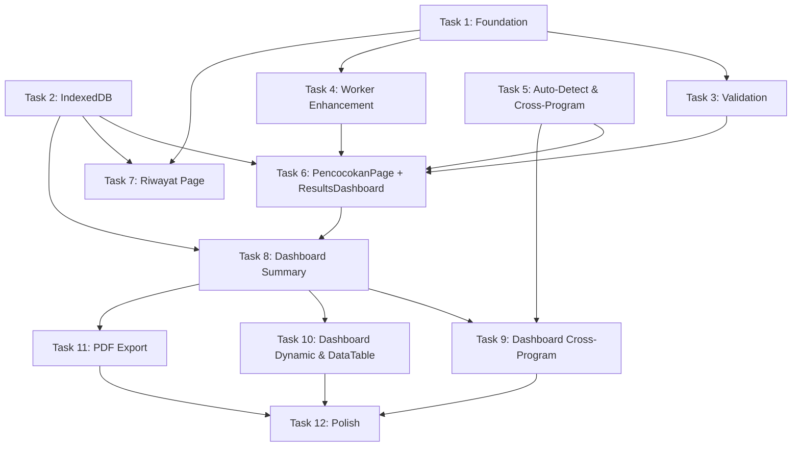

# Dashboard BI & Full SPA Redesign — Implementation Plan

> **For agentic workers:** REQUIRED SUB-SKILL: Use superpowers:subagent-driven-development (recommended) or superpowers:executing-plans to implement this plan task-by-task. Steps use checkbox (`- [ ]`) syntax for tracking.

**Goal:** Transform the Pencocokan Data NIK wizard app into a full SPA with React Router, Dashboard BI with cross-program analysis, IndexedDB history, enhanced validation, and PDF/Excel export.

**Architecture:** Full SPA with React Router v7 for page routing. Existing wizard logic preserved in `usePencocokanNIK` hook. New IndexedDB layer stores session results for history/dashboard. Recharts for visualizations. All processing remains 100% client-side via Web Worker.

**Tech Stack:** React 19, Vite 8, TailwindCSS v4, React Router v7, Recharts 2, SheetJS (xlsx), idb 8, jsPDF 2, jsPDF-AutoTable 3, Lucide React

## Global Constraints

- 100% offline — zero network requests for data processing
- Data never leaves the device — no external APIs
- Bundle must stay under 500KB gzipped total
- All UI text in Bahasa Indonesia
- TailwindCSS v4 for all styling (no inline styles or CSS modules)
- Web Worker for heavy processing — never block main thread
- Support modern browsers (Chrome 90+, Firefox 90+, Edge 90+)
- Existing matching algorithm and normalization logic must not be modified

---

## File Structure Map

### Files to CREATE
```
src/pages/LandingPage.jsx              # Route: / (moved from components/)
src/pages/PencocokanPage.jsx           # Route: /pencocokan (wizard orchestrator)
src/pages/RiwayatPage.jsx              # Route: /riwayat
src/pages/DashboardPage.jsx            # Route: /dashboard/:id

src/components/layout/Navbar.jsx       # Top navigation bar

src/components/pencocokan/UploadStep.jsx      # (moved)
src/components/pencocokan/UploadSlot.jsx      # (moved)
src/components/pencocokan/DataPreview.jsx     # (moved)
src/components/pencocokan/ConfigureStep.jsx   # (moved)
src/components/pencocokan/ColumnSelect.jsx    # (moved)
src/components/pencocokan/AnomalyStep.jsx     # (moved)
src/components/pencocokan/StepDot.jsx         # (moved)
src/components/pencocokan/ValidationReport.jsx # NEW
src/components/pencocokan/ResultsDashboard.jsx # NEW (replaces ResultsStep)

src/components/dashboard/SummaryPanel.jsx      # Metrics + gauge
src/components/dashboard/DistributionChart.jsx # Bar chart keterangan
src/components/dashboard/CrossProgramMatrix.jsx # Cross-program heatmap
src/components/dashboard/DuplicateRecipients.jsx # Penerima ganda table
src/components/dashboard/DynamicAnalysis.jsx    # Dynamic column charts
src/components/dashboard/DataTable.jsx          # Interactive data table
src/components/dashboard/ExportPanel.jsx        # Download xlsx + pdf

src/components/riwayat/SessionCard.jsx  # Session history card
src/components/riwayat/StorageInfo.jsx  # Storage usage info

src/components/ui/MetricCard.jsx        # (moved)

src/hooks/useRiwayat.js                # IndexedDB CRUD
src/hooks/useDashboard.js              # Dashboard data processing

src/utils/db.js                        # IndexedDB setup
src/utils/autoDetectColumns.js         # Auto-detect result columns
src/utils/crossProgramAnalysis.js      # Cross-program analysis
src/utils/dataValidation.js            # Enhanced validation
src/utils/pdfExport.js                 # PDF generation
```

### Files to MODIFY
```
src/main.jsx                           # Add React Router
src/App.jsx                            # Layout wrapper with Navbar
src/index.css                          # Additional utility animations
src/hooks/usePencocokanNIK.js          # Return dataHasil + keterangan distribution
src/utils/excelWorker.js               # Send back full row data + validation
index.html                             # Update title
package.json                           # New dependencies
```

### Files to DELETE
```
src/App.css                            # Unused Vite boilerplate
src/components/LandingPage.jsx         # Moved to pages/
src/components/ResultsStep.jsx         # Replaced by ResultsDashboard
src/components/UploadStep.jsx          # Moved to pencocokan/
src/components/UploadSlot.jsx          # Moved
src/components/DataPreview.jsx         # Moved
src/components/ConfigureStep.jsx       # Moved
src/components/ColumnSelect.jsx        # Moved
src/components/AnomalyStep.jsx         # Moved
src/components/StepDot.jsx             # Moved
src/components/MetricCard.jsx          # Moved to ui/
```

---

### Task 1: Foundation — Dependencies, Router, Folder Structure & Navbar

**Files:**
- Modify: `package.json`
- Modify: `src/main.jsx`
- Modify: `src/App.jsx`
- Modify: `src/index.css`
- Create: `src/components/layout/Navbar.jsx`
- Create: `src/pages/LandingPage.jsx`
- Create: `src/pages/PencocokanPage.jsx` (shell)
- Create: `src/pages/RiwayatPage.jsx` (shell)
- Create: `src/pages/DashboardPage.jsx` (shell)
- Move: all existing components to new locations
- Delete: `src/App.css`, old component locations

**Interfaces:**
- Produces: Router setup with 4 routes, Navbar component, page shells, all existing components at new paths

- [ ] **Step 1: Install new dependencies**

```bash
cd D:\Collage\magang\pencocokan-nik-baru
npm install react-router-dom recharts idb jspdf jspdf-autotable
```

Expected: All packages install without errors.

- [ ] **Step 2: Create folder structure and move existing components**

Create the new directory structure and move existing component files to their new locations:

```bash
cd D:\Collage\magang\pencocokan-nik-baru\src

# Create new directories
mkdir pages
mkdir components\layout
mkdir components\pencocokan
mkdir components\dashboard
mkdir components\riwayat
mkdir components\ui

# Move wizard components to pencocokan/
move components\UploadStep.jsx components\pencocokan\UploadStep.jsx
move components\UploadSlot.jsx components\pencocokan\UploadSlot.jsx
move components\DataPreview.jsx components\pencocokan\DataPreview.jsx
move components\ConfigureStep.jsx components\pencocokan\ConfigureStep.jsx
move components\ColumnSelect.jsx components\pencocokan\ColumnSelect.jsx
move components\AnomalyStep.jsx components\pencocokan\AnomalyStep.jsx
move components\StepDot.jsx components\pencocokan\StepDot.jsx

# Move generic UI components
move components\MetricCard.jsx components\ui\MetricCard.jsx

# Delete unused files
del App.css
```

- [ ] **Step 3: Update import paths in moved components**

Update internal imports in moved components. The following files need path fixes:

**`src/components/pencocokan/UploadStep.jsx`** — update imports:
```jsx
// Old: import UploadSlot from "./UploadSlot.jsx";
// Old: import DataPreview from "./DataPreview.jsx";
// New (same directory, no change needed for these two)
import UploadSlot from "./UploadSlot.jsx";
import DataPreview from "./DataPreview.jsx";
```
(No change needed — files are in the same directory now.)

**`src/components/pencocokan/ConfigureStep.jsx`** — update imports:
```jsx
// Old: import ColumnSelect from "./ColumnSelect.jsx";
// New (same directory, no change needed)
import ColumnSelect from "./ColumnSelect.jsx";
```
(No change needed.)

**`src/components/pencocokan/AnomalyStep.jsx`** — no internal imports to fix.

- [ ] **Step 4: Create Navbar component**

Create `src/components/layout/Navbar.jsx`:

```jsx
import { Link, useLocation } from "react-router-dom";
import { ShieldCheck, PlusCircle, History, Menu, X } from "lucide-react";
import { useState } from "react";

export default function Navbar({ jumlahSesi = 0 }) {
  const location = useLocation();
  const [menuOpen, setMenuOpen] = useState(false);

  const isActive = (path) => location.pathname === path;

  const navItems = [
    { to: "/pencocokan", label: "Pencocokan Baru", icon: PlusCircle },
    { to: "/riwayat", label: "Riwayat", icon: History, badge: jumlahSesi },
  ];

  return (
    <nav className="sticky top-0 z-50 bg-white/80 backdrop-blur-lg border-b border-slate-200/60 shadow-sm">
      <div className="max-w-7xl mx-auto px-4 sm:px-6">
        <div className="flex items-center justify-between h-14">
          {/* Logo */}
          <Link
            to="/"
            className="flex items-center gap-2.5 text-slate-800 hover:text-indigo-600 transition-colors"
          >
            <div className="w-8 h-8 rounded-lg bg-gradient-to-br from-indigo-500 to-indigo-600 flex items-center justify-center shadow-sm">
              <ShieldCheck size={16} className="text-white" />
            </div>
            <span className="font-bold text-sm tracking-tight hidden sm:inline">
              Pencocokan NIK
            </span>
          </Link>

          {/* Desktop Menu */}
          <div className="hidden sm:flex items-center gap-1">
            {navItems.map((item) => (
              <Link
                key={item.to}
                to={item.to}
                className={`relative inline-flex items-center gap-1.5 px-3 py-1.5 rounded-lg text-xs font-semibold transition-all duration-200 ${
                  isActive(item.to)
                    ? "bg-indigo-50 text-indigo-700"
                    : "text-slate-600 hover:text-slate-900 hover:bg-slate-50"
                }`}
              >
                <item.icon size={14} />
                {item.label}
                {item.badge > 0 && (
                  <span className="ml-0.5 inline-flex items-center justify-center min-w-[18px] h-[18px] px-1 rounded-full bg-indigo-600 text-white text-[10px] font-bold">
                    {item.badge}
                  </span>
                )}
              </Link>
            ))}
          </div>

          {/* Mobile Hamburger */}
          <button
            onClick={() => setMenuOpen(!menuOpen)}
            className="sm:hidden p-2 rounded-lg text-slate-500 hover:bg-slate-100 transition-colors"
          >
            {menuOpen ? <X size={18} /> : <Menu size={18} />}
          </button>
        </div>

        {/* Mobile Menu */}
        {menuOpen && (
          <div className="sm:hidden pb-3 pt-1 border-t border-slate-100 animate-fade-in">
            {navItems.map((item) => (
              <Link
                key={item.to}
                to={item.to}
                onClick={() => setMenuOpen(false)}
                className={`flex items-center gap-2 px-3 py-2.5 rounded-lg text-sm font-medium transition-colors ${
                  isActive(item.to)
                    ? "bg-indigo-50 text-indigo-700"
                    : "text-slate-600 hover:bg-slate-50"
                }`}
              >
                <item.icon size={16} />
                {item.label}
                {item.badge > 0 && (
                  <span className="ml-auto inline-flex items-center justify-center min-w-[20px] h-[20px] px-1.5 rounded-full bg-indigo-600 text-white text-[10px] font-bold">
                    {item.badge}
                  </span>
                )}
              </Link>
            ))}
          </div>
        )}
      </div>
    </nav>
  );
}
```

- [ ] **Step 5: Create page shells**

Create `src/pages/LandingPage.jsx` — refactored from the old `components/LandingPage.jsx`:

```jsx
import { useNavigate } from "react-router-dom";
import LandingContent from "../components/LandingContent.jsx";

export default function LandingPage({ jumlahSesi }) {
  const navigate = useNavigate();

  return (
    <LandingContent
      onStart={() => navigate("/pencocokan")}
      jumlahSesi={jumlahSesi}
      onRiwayat={() => navigate("/riwayat")}
    />
  );
}
```

Rename existing `src/components/LandingPage.jsx` to `src/components/LandingContent.jsx` and update its props:

```bash
cd D:\Collage\magang\pencocokan-nik-baru\src
move components\LandingPage.jsx components\LandingContent.jsx
```

Then edit `src/components/LandingContent.jsx`:
- Rename the component from `LandingPage` to `LandingContent`
- Change `export default function LandingPage({ onStart })` to `export default function LandingContent({ onStart, jumlahSesi = 0, onRiwayat })`
- Add a "Lihat Riwayat" button next to the existing CTA if `jumlahSesi > 0`:

In the Hero section, after the existing CTA button, add:
```jsx
{jumlahSesi > 0 && (
  <button
    onClick={onRiwayat}
    className="inline-flex items-center gap-2 px-5 py-2.5 rounded-xl border-2 border-indigo-200 text-indigo-700 font-semibold text-sm hover:bg-indigo-50 transition-all duration-200"
  >
    <History size={16} />
    Lihat Riwayat ({jumlahSesi})
  </button>
)}
```

Add `History` to the lucide-react import.

Create `src/pages/PencocokanPage.jsx` (shell — will be filled in Task 6):

```jsx
export default function PencocokanPage() {
  return (
    <div className="min-h-[calc(100vh-3.5rem)] flex items-center justify-center">
      <p className="text-slate-400 text-sm">Halaman Pencocokan — akan diisi di task berikutnya</p>
    </div>
  );
}
```

Create `src/pages/RiwayatPage.jsx` (shell):

```jsx
export default function RiwayatPage() {
  return (
    <div className="min-h-[calc(100vh-3.5rem)] flex items-center justify-center">
      <p className="text-slate-400 text-sm">Halaman Riwayat — akan diisi di task berikutnya</p>
    </div>
  );
}
```

Create `src/pages/DashboardPage.jsx` (shell):

```jsx
export default function DashboardPage() {
  return (
    <div className="min-h-[calc(100vh-3.5rem)] flex items-center justify-center">
      <p className="text-slate-400 text-sm">Dashboard BI — akan diisi di task berikutnya</p>
    </div>
  );
}
```

- [ ] **Step 6: Setup React Router in main.jsx**

Replace `src/main.jsx` with:

```jsx
import { StrictMode } from "react";
import { createRoot } from "react-dom/client";
import { BrowserRouter } from "react-router-dom";
import "./index.css";
import App from "./App.jsx";

createRoot(document.getElementById("root")).render(
  <StrictMode>
    <BrowserRouter>
      <App />
    </BrowserRouter>
  </StrictMode>
);
```

- [ ] **Step 7: Rewrite App.jsx as layout wrapper with routes**

Replace `src/App.jsx` with:

```jsx
import { Routes, Route, useLocation } from "react-router-dom";
import Navbar from "./components/layout/Navbar.jsx";
import LandingPage from "./pages/LandingPage.jsx";
import PencocokanPage from "./pages/PencocokanPage.jsx";
import RiwayatPage from "./pages/RiwayatPage.jsx";
import DashboardPage from "./pages/DashboardPage.jsx";

export default function App() {
  const location = useLocation();
  const isLanding = location.pathname === "/";

  // TODO: Replace with real count from useRiwayat hook in Task 2
  const jumlahSesi = 0;

  return (
    <div className="min-h-screen bg-gradient-to-br from-slate-50 via-white to-indigo-50/30">
      {!isLanding && <Navbar jumlahSesi={jumlahSesi} />}

      <Routes>
        <Route path="/" element={<LandingPage jumlahSesi={jumlahSesi} />} />
        <Route path="/pencocokan" element={<PencocokanPage />} />
        <Route path="/riwayat" element={<RiwayatPage />} />
        <Route path="/dashboard/:id" element={<DashboardPage />} />
      </Routes>
    </div>
  );
}
```

- [ ] **Step 8: Add utility CSS animations to index.css**

Append to `src/index.css` after existing content:

```css
@utility animate-slide-up {
  animation: slide-up 0.4s ease-out both;
}

@keyframes slide-up {
  from {
    opacity: 0;
    transform: translateY(16px);
  }
  to {
    opacity: 1;
    transform: translateY(0);
  }
}

@utility animate-scale-in {
  animation: scale-in 0.3s ease-out both;
}

@keyframes scale-in {
  from {
    opacity: 0;
    transform: scale(0.95);
  }
  to {
    opacity: 1;
    transform: scale(1);
  }
}
```

- [ ] **Step 9: Verify foundation works**

```bash
cd D:\Collage\magang\pencocokan-nik-baru
npm run dev
```

Verify in browser:
- `/` shows the landing page with Navbar hidden
- `/pencocokan` shows shell with Navbar visible
- `/riwayat` shows shell with Navbar visible
- Navbar links work and highlight active route
- Mobile hamburger menu works

- [ ] **Step 10: Commit**

```bash
git add -A
git commit -m "feat: foundation - React Router, folder restructure, Navbar layout"
```

---

### Task 2: IndexedDB Storage Layer

**Files:**
- Create: `src/utils/db.js`
- Create: `src/hooks/useRiwayat.js`

**Interfaces:**
- Produces:
  - `openDB()` → returns IDB database instance
  - `useRiwayat()` → `{ sesiList, jumlahSesi, simpanSesi(sesi), hapusSesi(id), hapusBanyakSesi(ids), ambilSesi(id), totalUkuran }`

- [ ] **Step 1: Create IndexedDB setup utility**

Create `src/utils/db.js`:

```js
import { openDB as idbOpen } from "idb";

const DB_NAME = "pencocokan-nik-db";
const DB_VERSION = 1;

export function openDB() {
  return idbOpen(DB_NAME, DB_VERSION, {
    upgrade(db) {
      if (!db.objectStoreNames.contains("sesi")) {
        const store = db.createObjectStore("sesi", { keyPath: "id" });
        store.createIndex("by-tanggal", "tanggal");
        store.createIndex("by-namaGabungan", "namaGabungan");
      }
    },
  });
}

export async function simpanSesi(sesi) {
  const db = await openDB();
  await db.put("sesi", sesi);
}

export async function ambilSesi(id) {
  const db = await openDB();
  return db.get("sesi", id);
}

export async function ambilSemuaSesi() {
  const db = await openDB();
  return db.getAllFromIndex("sesi", "by-tanggal");
}

export async function hapusSesi(id) {
  const db = await openDB();
  await db.delete("sesi", id);
}

export async function hapusBanyakSesi(ids) {
  const db = await openDB();
  const tx = db.transaction("sesi", "readwrite");
  await Promise.all(ids.map((id) => tx.store.delete(id)));
  await tx.done;
}

export async function hitungJumlahSesi() {
  const db = await openDB();
  return db.count("sesi");
}

export function generateId() {
  return crypto.randomUUID();
}
```

- [ ] **Step 2: Create useRiwayat hook**

Create `src/hooks/useRiwayat.js`:

```js
import { useState, useEffect, useCallback } from "react";
import {
  ambilSemuaSesi,
  simpanSesi as dbSimpan,
  hapusSesi as dbHapus,
  hapusBanyakSesi as dbHapusBanyak,
  ambilSesi as dbAmbil,
} from "../utils/db.js";

export function useRiwayat() {
  const [sesiList, setSesiList] = useState([]);
  const [loading, setLoading] = useState(true);

  const muat = useCallback(async () => {
    try {
      setLoading(true);
      const data = await ambilSemuaSesi();
      // Sort descending by tanggal (newest first)
      data.sort((a, b) => new Date(b.tanggal) - new Date(a.tanggal));
      setSesiList(data);
    } catch (err) {
      console.error("Gagal memuat riwayat:", err);
    } finally {
      setLoading(false);
    }
  }, []);

  useEffect(() => {
    muat();
  }, [muat]);

  const simpanSesi = useCallback(
    async (sesi) => {
      await dbSimpan(sesi);
      await muat();
    },
    [muat]
  );

  const hapusSesi = useCallback(
    async (id) => {
      await dbHapus(id);
      await muat();
    },
    [muat]
  );

  const hapusBanyakSesi = useCallback(
    async (ids) => {
      await dbHapusBanyak(ids);
      await muat();
    },
    [muat]
  );

  const ambilSesi = useCallback(async (id) => {
    return dbAmbil(id);
  }, []);

  // Estimate storage size in bytes (rough)
  const totalUkuran = sesiList.reduce((acc, s) => {
    const ringkasanSize = JSON.stringify(s.ringkasan || {}).length;
    const dataSize = s.dataHasil ? JSON.stringify(s.dataHasil).length : 0;
    const bufferSize = s.excelBuffer ? s.excelBuffer.byteLength : 0;
    return acc + ringkasanSize + dataSize + bufferSize;
  }, 0);

  return {
    sesiList,
    jumlahSesi: sesiList.length,
    loading,
    simpanSesi,
    hapusSesi,
    hapusBanyakSesi,
    ambilSesi,
    totalUkuran,
    muat,
  };
}
```

- [ ] **Step 3: Wire useRiwayat into App.jsx**

Update `src/App.jsx` — replace the `const jumlahSesi = 0;` line:

```jsx
import { useRiwayat } from "./hooks/useRiwayat.js";
```

Inside the component:
```jsx
const { jumlahSesi } = useRiwayat();
```

Remove the `const jumlahSesi = 0;` line.

- [ ] **Step 4: Verify IndexedDB works**

```bash
npm run dev
```

Open browser DevTools → Application → IndexedDB → `pencocokan-nik-db` should appear with empty `sesi` store.

- [ ] **Step 5: Commit**

```bash
git add -A
git commit -m "feat: IndexedDB storage layer with useRiwayat hook"
```

---

### Task 3: Enhanced Data Validation

**Files:**
- Create: `src/utils/dataValidation.js`
- Create: `src/components/pencocokan/ValidationReport.jsx`
- Modify: `src/utils/excelWorker.js` (add `VALIDATE_DATA` handler)

**Interfaces:**
- Consumes: `parsedGabungan` and `parsedPembanding` arrays from worker
- Produces:
  - `validateData(rows, kolomNik)` → `{ duplikatNik: [], barisKosong: number, nikKosong: number, nikNonStandar: number, totalValid: number }`
  - `<ValidationReport validasi={validasi} />` component

- [ ] **Step 1: Create dataValidation utility**

Create `src/utils/dataValidation.js`:

```js
import { normalisasiNIK } from "./normalize.js";

/**
 * Validate data quality for a parsed dataset.
 * @param {Array<Object>} rows - Parsed row objects
 * @param {string} kolomNik - NIK column name
 * @returns {Object} Validation report
 */
export function validateData(rows, kolomNik) {
  const nikCount = new Map();
  let barisKosong = 0;
  let nikKosong = 0;
  let nikNonStandar = 0;
  let totalValid = 0;

  for (const row of rows) {
    // Check empty rows (all values empty)
    const values = Object.values(row);
    const allEmpty = values.every(
      (v) => v === undefined || v === null || String(v).trim() === ""
    );
    if (allEmpty) {
      barisKosong++;
      continue;
    }

    const rawNik = row[kolomNik];
    if (rawNik === undefined || rawNik === null || String(rawNik).trim() === "") {
      nikKosong++;
      continue;
    }

    const nik = normalisasiNIK(rawNik);

    // Check non-standard NIK
    if (nik.length !== 16 || /[^0-9]/.test(nik)) {
      nikNonStandar++;
    } else {
      totalValid++;
    }

    // Count duplicates
    nikCount.set(nik, (nikCount.get(nik) || 0) + 1);
  }

  // Collect duplicate NIKs
  const duplikatNik = [];
  for (const [nik, count] of nikCount) {
    if (count > 1 && nik.length > 0) {
      duplikatNik.push({ nik, jumlah: count });
    }
  }
  duplikatNik.sort((a, b) => b.jumlah - a.jumlah);

  return {
    totalBaris: rows.length,
    barisKosong,
    nikKosong,
    nikNonStandar,
    totalValid,
    duplikatNik,
    persenNonStandar:
      rows.length > 0
        ? ((nikNonStandar / (rows.length - barisKosong)) * 100).toFixed(1)
        : 0,
  };
}
```

- [ ] **Step 2: Add VALIDATE_DATA handler to excelWorker.js**

Add the following case to the `self.onmessage` handler in `src/utils/excelWorker.js`, after the existing `SET_HEADER_ROW` case:

```js
case "VALIDATE_DATA": {
  const { target, kolomNik } = data;
  const rows = target === "gabungan" ? state.parsedGabungan : state.parsedPembanding;

  if (!rows || !kolomNik) {
    self.postMessage({ type: "VALIDATION_RESULT", target, result: null });
    return;
  }

  // Import inline since worker can't use ES module imports easily
  const nikCount = new Map();
  let barisKosong = 0;
  let nikKosong = 0;
  let nikNonStandar = 0;
  let totalValid = 0;

  for (const row of rows) {
    const values = Object.values(row);
    const allEmpty = values.every(
      (v) => v === undefined || v === null || String(v).trim() === ""
    );
    if (allEmpty) { barisKosong++; continue; }

    const rawNik = row[kolomNik];
    if (rawNik === undefined || rawNik === null || String(rawNik).trim() === "") {
      nikKosong++; continue;
    }

    const nik = normalisasiNIK(rawNik);
    if (nik.length !== 16 || /[^0-9]/.test(nik)) {
      nikNonStandar++;
    } else {
      totalValid++;
    }
    nikCount.set(nik, (nikCount.get(nik) || 0) + 1);
  }

  const duplikatNik = [];
  for (const [nik, count] of nikCount) {
    if (count > 1 && nik.length > 0) {
      duplikatNik.push({ nik, jumlah: count });
    }
  }
  duplikatNik.sort((a, b) => b.jumlah - a.jumlah);

  self.postMessage({
    type: "VALIDATION_RESULT",
    target,
    result: {
      totalBaris: rows.length,
      barisKosong,
      nikKosong,
      nikNonStandar,
      totalValid,
      duplikatNik: duplikatNik.slice(0, 100), // Limit to 100 for performance
      persenNonStandar:
        rows.length > 0
          ? ((nikNonStandar / (rows.length - barisKosong)) * 100).toFixed(1)
          : "0",
    },
  });
  break;
}
```

- [ ] **Step 3: Create ValidationReport component**

Create `src/components/pencocokan/ValidationReport.jsx`:

```jsx
import {
  AlertTriangle,
  CheckCircle2,
  Info,
  ChevronDown,
  ChevronUp,
  Copy,
} from "lucide-react";
import { useState } from "react";

function SeverityIcon({ type }) {
  if (type === "success")
    return <CheckCircle2 size={14} className="text-emerald-500 shrink-0" />;
  if (type === "warning")
    return <AlertTriangle size={14} className="text-amber-500 shrink-0" />;
  return <Info size={14} className="text-blue-500 shrink-0" />;
}

function ValidationItem({ type, label, value, detail, children }) {
  const [expanded, setExpanded] = useState(false);

  const bgMap = {
    success: "bg-emerald-50 border-emerald-200",
    warning: "bg-amber-50 border-amber-200",
    info: "bg-blue-50 border-blue-200",
  };

  return (
    <div
      className={`border rounded-xl px-3 py-2.5 ${bgMap[type]} transition-all duration-200`}
    >
      <div className="flex items-center gap-2">
        <SeverityIcon type={type} />
        <span className="text-xs font-medium text-slate-700 flex-1">
          {label}
        </span>
        <span className="text-xs font-bold text-slate-800">{value}</span>
        {children && (
          <button
            onClick={() => setExpanded(!expanded)}
            className="p-0.5 rounded hover:bg-white/50 transition-colors"
          >
            {expanded ? (
              <ChevronUp size={14} className="text-slate-400" />
            ) : (
              <ChevronDown size={14} className="text-slate-400" />
            )}
          </button>
        )}
      </div>
      {expanded && children && (
        <div className="mt-2 pt-2 border-t border-black/5 animate-fade-in">
          {children}
        </div>
      )}
    </div>
  );
}

export default function ValidationReport({ validasi, label }) {
  if (!validasi) return null;

  const {
    totalBaris,
    barisKosong,
    nikKosong,
    nikNonStandar,
    totalValid,
    duplikatNik,
    persenNonStandar,
  } = validasi;

  const hasIssues =
    barisKosong > 0 ||
    nikKosong > 0 ||
    nikNonStandar > 0 ||
    duplikatNik.length > 0;

  return (
    <div className="mt-3 animate-fade-in">
      <p className="text-xs font-semibold text-slate-600 mb-2 flex items-center gap-1.5">
        {hasIssues ? (
          <AlertTriangle size={12} className="text-amber-500" />
        ) : (
          <CheckCircle2 size={12} className="text-emerald-500" />
        )}
        Validasi Data {label}
      </p>

      <div className="space-y-1.5">
        <ValidationItem
          type="success"
          label="Baris valid"
          value={`${totalValid.toLocaleString("id-ID")} / ${totalBaris.toLocaleString("id-ID")}`}
        />

        {barisKosong > 0 && (
          <ValidationItem
            type="info"
            label="Baris kosong (akan diabaikan)"
            value={barisKosong.toLocaleString("id-ID")}
          />
        )}

        {nikKosong > 0 && (
          <ValidationItem
            type="warning"
            label="NIK kosong"
            value={nikKosong.toLocaleString("id-ID")}
          />
        )}

        {nikNonStandar > 0 && (
          <ValidationItem
            type={parseFloat(persenNonStandar) > 10 ? "warning" : "info"}
            label={`NIK format non-standar (${persenNonStandar}%)`}
            value={nikNonStandar.toLocaleString("id-ID")}
          />
        )}

        {duplikatNik.length > 0 && (
          <ValidationItem
            type="warning"
            label="NIK duplikat ditemukan"
            value={`${duplikatNik.length} NIK`}
          >
            <div className="max-h-32 overflow-y-auto">
              <table className="w-full text-[10px]">
                <thead>
                  <tr className="text-left text-slate-500">
                    <th className="pb-1">NIK</th>
                    <th className="pb-1 text-right">Muncul</th>
                  </tr>
                </thead>
                <tbody>
                  {duplikatNik.slice(0, 20).map((d) => (
                    <tr key={d.nik} className="text-slate-700">
                      <td className="py-0.5 font-mono">{d.nik}</td>
                      <td className="py-0.5 text-right font-bold">
                        {d.jumlah}×
                      </td>
                    </tr>
                  ))}
                </tbody>
              </table>
              {duplikatNik.length > 20 && (
                <p className="text-[10px] text-slate-400 mt-1">
                  ... dan {duplikatNik.length - 20} NIK duplikat lainnya
                </p>
              )}
            </div>
          </ValidationItem>
        )}
      </div>

      {hasIssues && (
        <p className="text-[10px] text-slate-400 mt-2 italic">
          ⚠️ Masalah di atas tidak memblokir proses. Anda tetap dapat
          melanjutkan pencocokan.
        </p>
      )}
    </div>
  );
}
```

- [ ] **Step 4: Verify validation components render**

Start dev server and verify ValidationReport renders correctly by temporarily importing it in any page shell with mock data.

- [ ] **Step 5: Commit**

```bash
git add -A
git commit -m "feat: enhanced data validation with ValidationReport component"
```

---

### Task 4: Enhance Worker to Return Full Data for Dashboard

**Files:**
- Modify: `src/utils/excelWorker.js` (FINALIZE_MATCHING case)
- Modify: `src/hooks/usePencocokanNIK.js` (capture dataHasil from worker)

**Interfaces:**
- Consumes: Existing worker `FINALIZE_MATCHING` message
- Produces: Worker now sends back `dataHasil` array, `keteranganDistribusi`, and `mismatchLog` alongside existing `excelBuffer`

- [ ] **Step 1: Modify FINALIZE_MATCHING in excelWorker.js to include dataHasil**

In `src/utils/excelWorker.js`, find the `FINALIZE_MATCHING` case. Near the end where it calls `self.postMessage` with type `MATCHING_SUCCESS`, update the message to also include `dataHasil`, `keteranganDistribusi`, and `mismatchLog`.

Before the existing `self.postMessage({ type: "MATCHING_SUCCESS", ... })`, add data collection:

```js
// Collect keterangan distribution
const keteranganDistribusi = {};
const dataHasil = [];
for (const row of state.parsedGabungan) {
  // dataHasil includes all original columns + result columns
  dataHasil.push({ ...row });

  const ket = row["Keterangan"] || "Lainnya";
  keteranganDistribusi[ket] = (keteranganDistribusi[ket] || 0) + 1;
}

// Collect mismatch log
const mismatchLog = [];
if (validatedNames && validatedNames.length > 0) {
  for (const vn of validatedNames) {
    mismatchLog.push({
      nik: vn.nik,
      namaGabungan: vn.namaGabungan,
      namaPembanding: vn.namaPembanding,
      keputusan: vn.keputusan,
    });
  }
}
```

Then update the postMessage to include the new fields:

```js
self.postMessage(
  {
    type: "MATCHING_SUCCESS",
    total,
    cocok,
    tidak,
    dikecualikanStatus,
    useStatus,
    mismatch: mismatchPreview,
    totalMismatch,
    excelBuffer,
    dataHasil,
    keteranganDistribusi,
    mismatchLog,
    kolomTersedia: state.parsedGabungan.length > 0
      ? Object.keys(state.parsedGabungan[0])
      : [],
  },
  [excelBuffer]
);
```

> [!NOTE]
> `dataHasil` is NOT transferred (only excelBuffer uses transferable). The array is cloned via structured clone. For datasets up to 100k rows this is acceptable performance.

- [ ] **Step 2: Update usePencocokanNIK to capture new data**

In `src/hooks/usePencocokanNIK.js`, add new state variables:

```js
const [dataHasil, setDataHasil] = useState(null);
const [keteranganDistribusi, setKeteranganDistribusi] = useState(null);
const [mismatchLog, setMismatchLog] = useState([]);
const [kolomTersedia, setKolomTersedia] = useState([]);
```

In the `MATCHING_SUCCESS` handler inside the `useEffect`, capture the new fields:

```js
case "MATCHING_SUCCESS":
  setDataHasil(msg.dataHasil);
  setKeteranganDistribusi(msg.keteranganDistribusi);
  setMismatchLog(msg.mismatchLog || []);
  setKolomTersedia(msg.kolomTersedia || []);
  // ... existing code
  break;
```

Add the new variables to the `reset` function:

```js
setDataHasil(null);
setKeteranganDistribusi(null);
setMismatchLog([]);
setKolomTersedia([]);
```

Add them to the return object:

```js
return {
  // ... existing returns
  dataHasil,
  keteranganDistribusi,
  mismatchLog,
  kolomTersedia,
};
```

- [ ] **Step 3: Verify worker returns data correctly**

Run the app, perform a matching operation, and verify in browser console that `dataHasil` is populated in the hook's state.

- [ ] **Step 4: Commit**

```bash
git add -A
git commit -m "feat: worker returns full dataHasil for dashboard consumption"
```

---

### Task 5: Auto-Detect Columns & Cross-Program Analysis Utilities

**Files:**
- Create: `src/utils/autoDetectColumns.js`
- Create: `src/utils/crossProgramAnalysis.js`

**Interfaces:**
- Consumes: `dataHasil: Array<Record<string, any>>`, `namaKolomBaru: string`
- Produces:
  - `detectProgramColumns(dataHasil, excludeColumn)` → `string[]`
  - `buildCrossMatrix(dataHasil, programColumns)` → `{ matrix, programs }`
  - `findDuplicateRecipients(dataHasil, programColumns, kolomNik, kolomNama)` → `Array<{nik, nama, programs, count}>`

- [ ] **Step 1: Create autoDetectColumns utility**

Create `src/utils/autoDetectColumns.js`:

```js
/**
 * Detect columns that are likely program/matching result columns.
 * A column is detected as a "program column" if >80% of its non-empty values
 * are 1 or 2 (as number or string).
 *
 * @param {Array<Record<string, any>>} rows - Data rows
 * @param {string} excludeColumn - Column to exclude (current session's result column)
 * @returns {string[]} Array of detected program column names
 */
export function detectProgramColumns(rows, excludeColumn = "") {
  if (!rows || rows.length === 0) return [];

  const columns = Object.keys(rows[0]);
  const programColumns = [];

  for (const col of columns) {
    if (col === excludeColumn) continue;
    if (col === "Keterangan") continue;

    let nonEmpty = 0;
    let matchCount = 0;

    for (const row of rows) {
      const val = row[col];
      if (val === undefined || val === null || String(val).trim() === "") continue;

      nonEmpty++;
      const num = Number(val);
      if (num === 1 || num === 2) {
        matchCount++;
      }
    }

    // Must have at least 10 non-empty values and >80% are 1 or 2
    if (nonEmpty >= 10 && matchCount / nonEmpty > 0.8) {
      programColumns.push(col);
    }
  }

  return programColumns;
}
```

- [ ] **Step 2: Create crossProgramAnalysis utility**

Create `src/utils/crossProgramAnalysis.js`:

```js
/**
 * Build a cross-program overlap matrix.
 * matrix[i][j] = number of rows where both program i and program j have value 1.
 *
 * @param {Array<Record<string, any>>} rows
 * @param {string[]} programColumns - Column names of detected programs
 * @returns {{ matrix: number[][], programs: string[] }}
 */
export function buildCrossMatrix(rows, programColumns) {
  const n = programColumns.length;
  const matrix = Array.from({ length: n }, () => Array(n).fill(0));

  for (const row of rows) {
    for (let i = 0; i < n; i++) {
      const valI = Number(row[programColumns[i]]);
      if (valI !== 1) continue;

      for (let j = i; j < n; j++) {
        const valJ = Number(row[programColumns[j]]);
        if (valJ === 1) {
          matrix[i][j]++;
          if (i !== j) matrix[j][i]++;
        }
      }
    }
  }

  return { matrix, programs: programColumns };
}

/**
 * Find rows that are matched (value=1) in more than one program.
 *
 * @param {Array<Record<string, any>>} rows
 * @param {string[]} programColumns
 * @param {string} kolomNik - NIK column name
 * @param {string} kolomNama - Nama column name
 * @returns {Array<{nik: string, nama: string, programs: Record<string, number>, count: number}>}
 */
export function findDuplicateRecipients(
  rows,
  programColumns,
  kolomNik,
  kolomNama
) {
  const results = [];

  for (const row of rows) {
    const programs = {};
    let count = 0;

    for (const col of programColumns) {
      const val = Number(row[col]);
      programs[col] = val;
      if (val === 1) count++;
    }

    if (count > 1) {
      results.push({
        nik: String(row[kolomNik] || ""),
        nama: String(row[kolomNama] || ""),
        programs,
        count,
      });
    }
  }

  // Sort by count descending
  results.sort((a, b) => b.count - a.count);
  return results;
}

/**
 * Get per-program summary: total matched, not matched, excluded.
 *
 * @param {Array<Record<string, any>>} rows
 * @param {string[]} programColumns
 * @returns {Array<{program: string, cocok: number, tidak: number}>}
 */
export function programSummary(rows, programColumns) {
  return programColumns.map((col) => {
    let cocok = 0;
    let tidak = 0;
    for (const row of rows) {
      const val = Number(row[col]);
      if (val === 1) cocok++;
      else if (val === 2) tidak++;
    }
    return { program: col, cocok, tidak };
  });
}
```

- [ ] **Step 3: Commit**

```bash
git add -A
git commit -m "feat: auto-detect program columns and cross-program analysis utilities"
```

---

### Task 6: PencocokanPage with Full Wizard & Inline Results Dashboard

**Files:**
- Create: `src/pages/PencocokanPage.jsx` (overwrite shell)
- Create: `src/components/pencocokan/ResultsDashboard.jsx`
- Create: `src/hooks/useDashboard.js`

**Interfaces:**
- Consumes: `usePencocokanNIK()`, `useRiwayat()`, `detectProgramColumns()`, `buildCrossMatrix()`
- Produces: Full wizard page with inline dashboard at step 4 that auto-saves to IndexedDB

- [ ] **Step 1: Create useDashboard hook**

Create `src/hooks/useDashboard.js`:

```js
import { useMemo } from "react";
import { detectProgramColumns } from "../utils/autoDetectColumns.js";
import {
  buildCrossMatrix,
  findDuplicateRecipients,
  programSummary,
} from "../utils/crossProgramAnalysis.js";

/**
 * Process dashboard data from matching results.
 *
 * @param {Object} params
 * @param {Array<Record<string, any>>} params.dataHasil
 * @param {string} params.namaKolomBaru
 * @param {string} params.kolomNik
 * @param {string} params.kolomNama
 * @param {Object} params.keteranganDistribusi
 */
export function useDashboard({
  dataHasil,
  namaKolomBaru,
  kolomNik,
  kolomNama,
  keteranganDistribusi,
}) {
  const kolomProgram = useMemo(() => {
    if (!dataHasil || dataHasil.length === 0) return [];
    return detectProgramColumns(dataHasil, namaKolomBaru);
  }, [dataHasil, namaKolomBaru]);

  const hasCrossProgram = kolomProgram.length > 0;

  const crossMatrix = useMemo(() => {
    if (!hasCrossProgram || !dataHasil) return null;
    // Include current column in matrix analysis
    const allPrograms = [...kolomProgram, namaKolomBaru].filter(Boolean);
    return buildCrossMatrix(dataHasil, allPrograms);
  }, [dataHasil, kolomProgram, namaKolomBaru, hasCrossProgram]);

  const penerimaGanda = useMemo(() => {
    if (!hasCrossProgram || !dataHasil) return [];
    const allPrograms = [...kolomProgram, namaKolomBaru].filter(Boolean);
    return findDuplicateRecipients(dataHasil, allPrograms, kolomNik, kolomNama);
  }, [dataHasil, kolomProgram, namaKolomBaru, kolomNik, kolomNama, hasCrossProgram]);

  const ringkasanProgram = useMemo(() => {
    if (!hasCrossProgram || !dataHasil) return [];
    const allPrograms = [...kolomProgram, namaKolomBaru].filter(Boolean);
    return programSummary(dataHasil, allPrograms);
  }, [dataHasil, kolomProgram, namaKolomBaru, hasCrossProgram]);

  // Format keterangan distribusi for chart
  const chartKeterangan = useMemo(() => {
    if (!keteranganDistribusi) return [];
    return Object.entries(keteranganDistribusi)
      .map(([label, value]) => ({ label, value }))
      .sort((a, b) => b.value - a.value);
  }, [keteranganDistribusi]);

  return {
    kolomProgram,
    hasCrossProgram,
    crossMatrix,
    penerimaGanda,
    ringkasanProgram,
    chartKeterangan,
  };
}
```

- [ ] **Step 2: Create ResultsDashboard component**

Create `src/components/pencocokan/ResultsDashboard.jsx`:

```jsx
import { useEffect, useRef } from "react";
import { useNavigate } from "react-router-dom";
import {
  Download,
  FileText,
  BarChart3,
  RotateCcw,
  CheckCircle2,
  XCircle,
  MinusCircle,
  Users,
} from "lucide-react";
import MetricCard from "../ui/MetricCard.jsx";
import {
  PieChart,
  Pie,
  Cell,
  ResponsiveContainer,
  Tooltip,
} from "recharts";

const COLORS = {
  cocok: "#10b981",
  tidak: "#ef4444",
  dikecualikan: "#f59e0b",
};

export default function ResultsDashboard({
  hasil,
  dataHasil,
  namaKolomBaru,
  namaGabungan,
  namaPembanding,
  sesiId,
  onReset,
  onDownload,
  onSavePdf,
  hasSaved,
}) {
  const navigate = useNavigate();

  if (!hasil) return null;

  const { total, cocok, tidak, dikecualikanStatus, useStatus, totalMismatch } =
    hasil;
  const persentase = total > 0 ? ((cocok / total) * 100).toFixed(1) : 0;

  const pieData = [
    { name: "Cocok", value: cocok, color: COLORS.cocok },
    { name: "Tidak Cocok", value: tidak, color: COLORS.tidak },
    ...(useStatus && dikecualikanStatus > 0
      ? [
          {
            name: "Dikecualikan",
            value: dikecualikanStatus,
            color: COLORS.dikecualikan,
          },
        ]
      : []),
  ];

  return (
    <div className="space-y-5 animate-fade-in">
      {/* Success Banner */}
      <div className="text-center py-3">
        <div className="inline-flex items-center gap-2 px-4 py-2 rounded-full bg-emerald-50 border border-emerald-200 text-emerald-700 text-xs font-semibold">
          <CheckCircle2 size={14} />
          Pencocokan selesai — Data tersimpan otomatis
        </div>
      </div>

      {/* Donut Chart */}
      <div className="bg-white rounded-2xl border border-slate-200/60 shadow-sm p-5">
        <div className="flex items-center justify-center">
          <div className="relative w-44 h-44">
            <ResponsiveContainer width="100%" height="100%">
              <PieChart>
                <Pie
                  data={pieData}
                  cx="50%"
                  cy="50%"
                  innerRadius={52}
                  outerRadius={70}
                  dataKey="value"
                  strokeWidth={2}
                  stroke="#fff"
                >
                  {pieData.map((entry, i) => (
                    <Cell key={i} fill={entry.color} />
                  ))}
                </Pie>
                <Tooltip
                  formatter={(val) => val.toLocaleString("id-ID")}
                  contentStyle={{
                    borderRadius: "12px",
                    border: "1px solid #e2e8f0",
                    fontSize: "12px",
                  }}
                />
              </PieChart>
            </ResponsiveContainer>
            {/* Center text */}
            <div className="absolute inset-0 flex flex-col items-center justify-center">
              <span className="text-2xl font-bold text-slate-900">
                {persentase}%
              </span>
              <span className="text-[10px] text-slate-400 font-medium">
                Cocok
              </span>
            </div>
          </div>
        </div>

        {/* Legend */}
        <div className="flex justify-center gap-4 mt-3">
          {pieData.map((d) => (
            <div key={d.name} className="flex items-center gap-1.5 text-xs">
              <div
                className="w-2.5 h-2.5 rounded-full"
                style={{ backgroundColor: d.color }}
              />
              <span className="text-slate-600">{d.name}</span>
            </div>
          ))}
        </div>
      </div>

      {/* Metric Cards */}
      <div className="grid grid-cols-2 gap-2.5">
        <MetricCard
          label="Total Baris"
          value={total.toLocaleString("id-ID")}
          tone="neutral"
        />
        <MetricCard
          label="Cocok"
          value={cocok.toLocaleString("id-ID")}
          tone="success"
        />
        <MetricCard
          label="Tidak Cocok"
          value={tidak.toLocaleString("id-ID")}
          tone="danger"
        />
        {useStatus && (
          <MetricCard
            label="Dikecualikan"
            value={dikecualikanStatus.toLocaleString("id-ID")}
            tone="warning"
          />
        )}
      </div>

      {/* Mismatch summary */}
      {totalMismatch > 0 && (
        <div className="flex items-center gap-2 bg-amber-50 border border-amber-200 rounded-xl px-3 py-2.5 text-xs text-amber-800 font-medium">
          <Users size={14} className="shrink-0" />
          {totalMismatch.toLocaleString("id-ID")} perbedaan nama terdeteksi
          (lihat detail di Dashboard Lengkap)
        </div>
      )}

      {/* Action Buttons */}
      <div className="space-y-2">
        <div className="grid grid-cols-2 gap-2">
          <button
            onClick={onDownload}
            className="flex items-center justify-center gap-2 px-4 py-2.5 bg-indigo-600 text-white rounded-xl text-xs font-semibold hover:bg-indigo-700 transition-colors shadow-sm cursor-pointer"
          >
            <Download size={14} />
            Unduh Excel
          </button>
          <button
            onClick={onSavePdf}
            className="flex items-center justify-center gap-2 px-4 py-2.5 bg-white border border-slate-200 text-slate-700 rounded-xl text-xs font-semibold hover:bg-slate-50 transition-colors cursor-pointer"
          >
            <FileText size={14} />
            Unduh PDF
          </button>
        </div>

        {sesiId && (
          <button
            onClick={() => navigate(`/dashboard/${sesiId}`)}
            className="w-full flex items-center justify-center gap-2 px-4 py-2.5 bg-gradient-to-r from-indigo-500 to-purple-500 text-white rounded-xl text-xs font-semibold hover:from-indigo-600 hover:to-purple-600 transition-all shadow-sm cursor-pointer"
          >
            <BarChart3 size={14} />
            Lihat Dashboard Lengkap
          </button>
        )}

        <button
          onClick={onReset}
          className="w-full flex items-center justify-center gap-2 px-4 py-2.5 text-slate-500 hover:text-slate-700 hover:bg-slate-50 rounded-xl text-xs font-medium transition-colors cursor-pointer"
        >
          <RotateCcw size={14} />
          Pencocokan Baru
        </button>
      </div>
    </div>
  );
}
```

- [ ] **Step 3: Create full PencocokanPage**

Overwrite `src/pages/PencocokanPage.jsx` with the full wizard orchestrator. This is essentially the old `App.jsx` logic moved here, with the following changes:
- Uses components from new paths
- Step 4 uses `ResultsDashboard` instead of `ResultsStep`
- Auto-saves to IndexedDB when results are ready
- Integrates validation report in step 1

```jsx
import { useState, useEffect, useRef } from "react";
import { useNavigate } from "react-router-dom";
import { usePencocokanNIK } from "../hooks/usePencocokanNIK.js";
import { useRiwayat } from "../hooks/useRiwayat.js";
import { generateId } from "../utils/db.js";
import StepDot from "../components/pencocokan/StepDot.jsx";
import UploadStep from "../components/pencocokan/UploadStep.jsx";
import ConfigureStep from "../components/pencocokan/ConfigureStep.jsx";
import AnomalyStep from "../components/pencocokan/AnomalyStep.jsx";
import ResultsDashboard from "../components/pencocokan/ResultsDashboard.jsx";
import { AlertTriangle, ShieldCheck } from "lucide-react";

export default function PencocokanPage() {
  const navigate = useNavigate();
  const { simpanSesi } = useRiwayat();
  const [sesiId, setSesiId] = useState(null);
  const savedRef = useRef(false);

  const {
    step, setStep,
    gabungan, pembanding,
    barisHeaderGabungan, barisHeaderPembanding,
    error,
    loadingGabungan, loadingPembanding, loadingMatching,
    progress, progressText,
    kolomNikGabungan, kolomNamaGabungan,
    kolomNikPembanding, kolomNamaPembanding,
    kolomStatusPembanding, statusTerpilih, namaKolomBaru,
    daftarStatusUnik, anomalies,
    nameMismatchResolutions, invalidNikResolutions,
    setNameMismatchResolutions, setInvalidNikResolutions,
    hasil, dataHasil, keteranganDistribusi, mismatchLog, kolomTersedia,
    reset,
    handleGabunganFile, handlePembandingFile,
    ubahBarisHeaderGabungan, ubahBarisHeaderPembanding,
    goToConfigure, ubahKolomStatus, toggleStatus,
    setKolomNikGabungan, setKolomNamaGabungan,
    setKolomNikPembanding, setKolomNamaPembanding,
    setNamaKolomBaru,
    scanAnomalies, finalizeMatching, handleDownload,
    excelBuffer,
  } = usePencocokanNIK();

  const hasAnomalies =
    anomalies.nameMismatches.length > 0 || anomalies.invalidNiks.length > 0;

  // Auto-save to IndexedDB when results are ready
  useEffect(() => {
    if (step === 4 && hasil && dataHasil && !savedRef.current) {
      savedRef.current = true;
      const id = generateId();
      setSesiId(id);

      simpanSesi({
        id,
        tanggal: new Date().toISOString(),
        namaGabungan: gabungan?.fileName || "",
        namaPembanding: pembanding?.fileName || "",
        namaKolomBaru,
        konfigurasi: {
          kolomNikGabungan,
          kolomNamaGabungan,
          kolomNikPembanding,
          kolomNamaPembanding,
          kolomStatusPembanding,
          statusTerpilih: Array.from(statusTerpilih || []),
        },
        ringkasan: {
          total: hasil.total,
          cocok: hasil.cocok,
          tidak: hasil.tidak,
          dikecualikanStatus: hasil.dikecualikanStatus,
          totalMismatch: hasil.totalMismatch || 0,
          totalInvalidNik: anomalies.invalidNiks.length,
          persentase:
            hasil.total > 0
              ? parseFloat(((hasil.cocok / hasil.total) * 100).toFixed(1))
              : 0,
        },
        dataHasil,
        mismatchLog: mismatchLog || [],
        excelBuffer: excelBuffer || null,
        kolomTersedia: kolomTersedia || [],
        keteranganDistribusi: keteranganDistribusi || {},
      });
    }
  }, [step, hasil, dataHasil]);

  const handleReset = () => {
    savedRef.current = false;
    setSesiId(null);
    reset();
  };

  const handleSetNameResolution = (id, resolution) => {
    setNameMismatchResolutions((prev) => ({ ...prev, [id]: resolution }));
  };

  const handleSetNikResolution = (id, resolution) => {
    setInvalidNikResolutions((prev) => ({ ...prev, [id]: resolution }));
  };

  const handleBulkNameResolution = (resolution) => {
    const nextRes = { ...nameMismatchResolutions };
    anomalies.nameMismatches.forEach((item) => {
      nextRes[item.id] = resolution;
    });
    setNameMismatchResolutions(nextRes);
  };

  const handleBulkNikResolution = (resolution) => {
    const nextRes = { ...invalidNikResolutions };
    anomalies.invalidNiks.forEach((item) => {
      nextRes[item.id] = resolution;
    });
    setInvalidNikResolutions(nextRes);
  };

  return (
    <div className="flex items-start justify-center px-4 py-8 sm:py-12 animate-fade-in">
      <div className="w-full max-w-xl">
        {/* Header */}
        <div className="mb-8 text-center">
          <div className="inline-flex items-center justify-center w-12 h-12 rounded-2xl bg-indigo-100 text-indigo-600 mb-4 shadow-sm">
            <ShieldCheck size={24} />
          </div>
          <h1 className="text-xl font-bold m-0 mb-1.5 text-slate-900 tracking-tight">
            Pencocokan Data NIK
          </h1>
          <p className="text-xs sm:text-sm text-slate-500 m-0 max-w-sm mx-auto leading-relaxed">
            Cocokkan data gabungan OPD dengan data pembanding, lalu unduh hasil
            dalam format Excel. 100% offline &amp; aman.
          </p>
        </div>

        {/* Step Indicator */}
        <div className="flex gap-2 mb-7">
          <StepDot index={1} label="Unggah" active={step === 1} done={step > 1} />
          <StepDot index={2} label="Konfigurasi" active={step === 2} done={step > 2} />
          {hasAnomalies && (
            <StepDot index={3} label="Anomali" active={step === 3} done={step > 3} />
          )}
          <StepDot
            index={hasAnomalies ? 4 : 3}
            label="Hasil"
            active={step === 4}
            done={false}
          />
        </div>

        {/* Error */}
        {error && (
          <div className="flex items-start gap-2 bg-red-50 text-red-700 border border-red-200 rounded-xl px-4 py-3 text-sm mb-4 animate-fade-in font-medium">
            <AlertTriangle size={16} className="shrink-0 mt-0.5" />
            <span>{error}</span>
          </div>
        )}

        {/* Steps */}
        {step === 1 && (
          <UploadStep
            gabungan={gabungan}
            pembanding={pembanding}
            barisHeaderGabungan={barisHeaderGabungan}
            barisHeaderPembanding={barisHeaderPembanding}
            loadingGabungan={loadingGabungan}
            loadingPembanding={loadingPembanding}
            onGabunganFile={handleGabunganFile}
            onPembandingFile={handlePembandingFile}
            onBarisHeaderGabungan={ubahBarisHeaderGabungan}
            onBarisHeaderPembanding={ubahBarisHeaderPembanding}
            onNext={goToConfigure}
          />
        )}

        {step === 2 && gabungan && pembanding && (
          <ConfigureStep
            gabungan={gabungan}
            pembanding={pembanding}
            kolomNikGabungan={kolomNikGabungan}
            kolomNamaGabungan={kolomNamaGabungan}
            kolomNikPembanding={kolomNikPembanding}
            kolomNamaPembanding={kolomNamaPembanding}
            kolomStatusPembanding={kolomStatusPembanding}
            statusTerpilih={statusTerpilih}
            namaKolomBaru={namaKolomBaru}
            daftarStatusUnik={daftarStatusUnik}
            onKolomNikGabungan={setKolomNikGabungan}
            onKolomNamaGabungan={setKolomNamaGabungan}
            onKolomNikPembanding={setKolomNikPembanding}
            onKolomNamaPembanding={setKolomNamaPembanding}
            onKolomStatus={ubahKolomStatus}
            onToggleStatus={toggleStatus}
            onNamaKolomBaru={setNamaKolomBaru}
            onBack={() => setStep(1)}
            onProses={scanAnomalies}
            loadingMatching={loadingMatching}
            progressText={progressText}
            progress={progress}
          />
        )}

        {step === 3 && hasAnomalies && (
          <AnomalyStep
            anomalies={anomalies}
            nameMismatchResolutions={nameMismatchResolutions}
            invalidNikResolutions={invalidNikResolutions}
            onSetNameResolution={handleSetNameResolution}
            onSetNikResolution={handleSetNikResolution}
            onBulkNameResolution={handleBulkNameResolution}
            onBulkNikResolution={handleBulkNikResolution}
            onBack={() => setStep(2)}
            onNext={() =>
              finalizeMatching(nameMismatchResolutions, invalidNikResolutions)
            }
            loadingMatching={loadingMatching}
          />
        )}

        {step === 4 && hasil && (
          <ResultsDashboard
            hasil={hasil}
            dataHasil={dataHasil}
            namaKolomBaru={namaKolomBaru}
            namaGabungan={gabungan?.fileName}
            namaPembanding={pembanding?.fileName}
            sesiId={sesiId}
            onReset={handleReset}
            onDownload={handleDownload}
            onSavePdf={() => {
              /* Will be implemented in Task 11 */
            }}
            hasSaved={savedRef.current}
          />
        )}

        {/* Privacy footer */}
        <p className="text-center text-xs text-slate-400 mt-8">
          Proses dilakukan sepenuhnya di web browser komputer Anda tanpa
          mengirim data keluar.
        </p>
      </div>
    </div>
  );
}
```

- [ ] **Step 4: Update usePencocokanNIK to expose excelBuffer**

In `src/hooks/usePencocokanNIK.js`, add `excelBuffer` to the return object (the state variable already exists as it's used in `handleDownload`):

```js
return {
  // ... existing returns
  excelBuffer,
};
```

- [ ] **Step 5: Delete old ResultsStep.jsx**

```bash
del D:\Collage\magang\pencocokan-nik-baru\src\components\ResultsStep.jsx
```

- [ ] **Step 6: Verify full wizard works**

```bash
npm run dev
```

Navigate to `/pencocokan`, upload two test Excel files, run through the wizard, and verify:
- All 4 steps work correctly
- Step 4 shows the new ResultsDashboard with donut chart
- Data is saved to IndexedDB (check DevTools → Application → IndexedDB)
- Download Excel button works
- "Pencocokan Baru" resets correctly

- [ ] **Step 7: Commit**

```bash
git add -A
git commit -m "feat: PencocokanPage with ResultsDashboard and IndexedDB auto-save"
```

---

### Task 7: Riwayat (History) Page

**Files:**
- Overwrite: `src/pages/RiwayatPage.jsx`
- Create: `src/components/riwayat/SessionCard.jsx`
- Create: `src/components/riwayat/StorageInfo.jsx`

**Interfaces:**
- Consumes: `useRiwayat()` → `{ sesiList, hapusSesi, hapusBanyakSesi, totalUkuran }`
- Produces: Full history page with session cards, bulk delete, storage info

- [ ] **Step 1: Create SessionCard component**

Create `src/components/riwayat/SessionCard.jsx`:

```jsx
import { useNavigate } from "react-router-dom";
import {
  BarChart3,
  Download,
  Trash2,
  Calendar,
  FileSpreadsheet,
  ArrowRightLeft,
} from "lucide-react";

export default function SessionCard({ sesi, onHapus, selected, onToggleSelect }) {
  const navigate = useNavigate();
  const { id, tanggal, namaGabungan, namaPembanding, namaKolomBaru, ringkasan } =
    sesi;

  const persen = ringkasan?.persentase ?? 0;
  const tanggalFormatted = new Date(tanggal).toLocaleDateString("id-ID", {
    day: "numeric",
    month: "short",
    year: "numeric",
    hour: "2-digit",
    minute: "2-digit",
  });

  const handleDownload = (e) => {
    e.stopPropagation();
    if (!sesi.excelBuffer) return;
    const blob = new Blob([sesi.excelBuffer], {
      type: "application/octet-stream",
    });
    const url = URL.createObjectURL(blob);
    const a = document.createElement("a");
    a.href = url;
    a.download = `hasil_${namaKolomBaru || "pencocokan"}.xlsx`;
    a.click();
    URL.revokeObjectURL(url);
  };

  return (
    <div
      className={`group bg-white rounded-2xl border shadow-sm p-4 transition-all duration-200 hover:shadow-md ${
        selected
          ? "border-indigo-300 bg-indigo-50/30 ring-2 ring-indigo-200"
          : "border-slate-200/60"
      }`}
    >
      <div className="flex items-start gap-3">
        {/* Checkbox */}
        <input
          type="checkbox"
          checked={selected}
          onChange={onToggleSelect}
          className="mt-1 w-4 h-4 rounded border-slate-300 text-indigo-600 focus:ring-indigo-500 cursor-pointer"
        />

        <div className="flex-1 min-w-0">
          {/* Header */}
          <div className="flex items-center gap-2 mb-1.5">
            <Calendar size={12} className="text-slate-400" />
            <span className="text-[10px] text-slate-400 font-medium">
              {tanggalFormatted}
            </span>
          </div>

          {/* File names */}
          <div className="space-y-1 mb-3">
            <div className="flex items-center gap-1.5">
              <FileSpreadsheet size={12} className="text-slate-400 shrink-0" />
              <span className="text-xs font-medium text-slate-700 truncate">
                {namaGabungan}
              </span>
            </div>
            <div className="flex items-center gap-1.5">
              <ArrowRightLeft size={12} className="text-indigo-400 shrink-0" />
              <span className="text-xs text-slate-500 truncate">
                vs {namaPembanding}
              </span>
            </div>
          </div>

          {/* Progress bar */}
          <div className="flex items-center gap-3">
            <div className="flex-1 h-2 bg-slate-100 rounded-full overflow-hidden">
              <div
                className="h-full rounded-full transition-all duration-500"
                style={{
                  width: `${persen}%`,
                  backgroundColor:
                    persen >= 70
                      ? "#10b981"
                      : persen >= 40
                        ? "#f59e0b"
                        : "#ef4444",
                }}
              />
            </div>
            <span className="text-xs font-bold text-slate-700 w-12 text-right">
              {persen}%
            </span>
          </div>

          {/* Stats row */}
          <div className="flex gap-3 mt-2 text-[10px] text-slate-500">
            <span>
              <span className="font-bold text-slate-700">
                {(ringkasan?.total || 0).toLocaleString("id-ID")}
              </span>{" "}
              total
            </span>
            <span>
              <span className="font-bold text-emerald-600">
                {(ringkasan?.cocok || 0).toLocaleString("id-ID")}
              </span>{" "}
              cocok
            </span>
            <span>
              <span className="font-bold text-red-500">
                {(ringkasan?.tidak || 0).toLocaleString("id-ID")}
              </span>{" "}
              tidak
            </span>
          </div>
        </div>
      </div>

      {/* Actions */}
      <div className="flex gap-1.5 mt-3 pt-3 border-t border-slate-100">
        <button
          onClick={() => navigate(`/dashboard/${id}`)}
          className="flex-1 flex items-center justify-center gap-1.5 px-3 py-2 bg-indigo-50 text-indigo-700 rounded-xl text-[11px] font-semibold hover:bg-indigo-100 transition-colors cursor-pointer"
        >
          <BarChart3 size={13} />
          Dashboard
        </button>
        <button
          onClick={handleDownload}
          disabled={!sesi.excelBuffer}
          className="flex items-center justify-center gap-1.5 px-3 py-2 bg-slate-50 text-slate-600 rounded-xl text-[11px] font-medium hover:bg-slate-100 transition-colors cursor-pointer disabled:opacity-40"
        >
          <Download size={13} />
        </button>
        <button
          onClick={(e) => {
            e.stopPropagation();
            onHapus(id);
          }}
          className="flex items-center justify-center gap-1.5 px-3 py-2 text-red-400 hover:bg-red-50 hover:text-red-600 rounded-xl text-[11px] font-medium transition-colors cursor-pointer"
        >
          <Trash2 size={13} />
        </button>
      </div>
    </div>
  );
}
```

- [ ] **Step 2: Create StorageInfo component**

Create `src/components/riwayat/StorageInfo.jsx`:

```jsx
import { HardDrive } from "lucide-react";

function formatBytes(bytes) {
  if (bytes === 0) return "0 B";
  const k = 1024;
  const sizes = ["B", "KB", "MB", "GB"];
  const i = Math.floor(Math.log(bytes) / Math.log(k));
  return `${parseFloat((bytes / Math.pow(k, i)).toFixed(1))} ${sizes[i]}`;
}

export default function StorageInfo({ totalUkuran, jumlahSesi }) {
  return (
    <div className="flex items-center gap-2 px-3 py-2 bg-slate-50 rounded-xl text-xs text-slate-500">
      <HardDrive size={13} className="shrink-0" />
      <span>
        {formatBytes(totalUkuran)} digunakan · {jumlahSesi} sesi tersimpan
      </span>
    </div>
  );
}
```

- [ ] **Step 3: Create full RiwayatPage**

Overwrite `src/pages/RiwayatPage.jsx`:

```jsx
import { useState, useMemo } from "react";
import { useNavigate } from "react-router-dom";
import { useRiwayat } from "../hooks/useRiwayat.js";
import SessionCard from "../components/riwayat/SessionCard.jsx";
import StorageInfo from "../components/riwayat/StorageInfo.jsx";
import {
  History,
  Search,
  Trash2,
  PlusCircle,
  ArrowUpDown,
  Loader2,
  Inbox,
} from "lucide-react";

export default function RiwayatPage() {
  const navigate = useNavigate();
  const { sesiList, jumlahSesi, loading, hapusSesi, hapusBanyakSesi, totalUkuran } =
    useRiwayat();
  const [search, setSearch] = useState("");
  const [sortBy, setSortBy] = useState("tanggal"); // tanggal | persentase
  const [selectedIds, setSelectedIds] = useState(new Set());

  const filtered = useMemo(() => {
    let list = sesiList;

    if (search.trim()) {
      const q = search.toLowerCase();
      list = list.filter(
        (s) =>
          s.namaGabungan.toLowerCase().includes(q) ||
          s.namaPembanding.toLowerCase().includes(q) ||
          (s.namaKolomBaru || "").toLowerCase().includes(q)
      );
    }

    if (sortBy === "persentase") {
      list = [...list].sort(
        (a, b) => (b.ringkasan?.persentase || 0) - (a.ringkasan?.persentase || 0)
      );
    }
    // Default: already sorted by tanggal descending from hook

    return list;
  }, [sesiList, search, sortBy]);

  const toggleSelect = (id) => {
    setSelectedIds((prev) => {
      const next = new Set(prev);
      if (next.has(id)) next.delete(id);
      else next.add(id);
      return next;
    });
  };

  const handleBulkDelete = async () => {
    if (selectedIds.size === 0) return;
    if (
      !window.confirm(
        `Hapus ${selectedIds.size} sesi yang dipilih? Tindakan ini tidak dapat dibatalkan.`
      )
    )
      return;
    await hapusBanyakSesi(Array.from(selectedIds));
    setSelectedIds(new Set());
  };

  if (loading) {
    return (
      <div className="flex items-center justify-center min-h-[50vh]">
        <Loader2 size={24} className="animate-spin text-indigo-400" />
      </div>
    );
  }

  return (
    <div className="max-w-2xl mx-auto px-4 py-8 animate-fade-in">
      {/* Header */}
      <div className="flex items-center gap-3 mb-6">
        <div className="w-10 h-10 rounded-xl bg-indigo-100 flex items-center justify-center">
          <History size={20} className="text-indigo-600" />
        </div>
        <div>
          <h1 className="text-lg font-bold text-slate-900 tracking-tight">
            Riwayat Pencocokan
          </h1>
          <p className="text-xs text-slate-500">
            {jumlahSesi} sesi tersimpan di perangkat ini
          </p>
        </div>
      </div>

      {jumlahSesi === 0 ? (
        /* Empty state */
        <div className="text-center py-16">
          <div className="inline-flex items-center justify-center w-16 h-16 rounded-2xl bg-slate-100 mb-4">
            <Inbox size={28} className="text-slate-300" />
          </div>
          <p className="text-sm text-slate-500 mb-4">
            Belum ada riwayat pencocokan
          </p>
          <button
            onClick={() => navigate("/pencocokan")}
            className="inline-flex items-center gap-2 px-4 py-2.5 bg-indigo-600 text-white rounded-xl text-xs font-semibold hover:bg-indigo-700 transition-colors cursor-pointer"
          >
            <PlusCircle size={14} />
            Mulai Pencocokan
          </button>
        </div>
      ) : (
        <>
          {/* Toolbar */}
          <div className="flex items-center gap-2 mb-4">
            <div className="relative flex-1">
              <Search
                size={14}
                className="absolute left-3 top-1/2 -translate-y-1/2 text-slate-400"
              />
              <input
                type="text"
                placeholder="Cari nama file..."
                value={search}
                onChange={(e) => setSearch(e.target.value)}
                className="w-full pl-8 pr-3 py-2 bg-white border border-slate-200 rounded-xl text-xs text-slate-700 placeholder:text-slate-400 focus:outline-none focus:ring-2 focus:ring-indigo-200 focus:border-indigo-300 transition-all"
              />
            </div>

            <button
              onClick={() =>
                setSortBy(sortBy === "tanggal" ? "persentase" : "tanggal")
              }
              className="flex items-center gap-1.5 px-3 py-2 bg-white border border-slate-200 rounded-xl text-xs text-slate-600 hover:bg-slate-50 transition-colors cursor-pointer"
            >
              <ArrowUpDown size={13} />
              {sortBy === "tanggal" ? "Tanggal" : "% Cocok"}
            </button>

            {selectedIds.size > 0 && (
              <button
                onClick={handleBulkDelete}
                className="flex items-center gap-1.5 px-3 py-2 bg-red-50 text-red-600 border border-red-200 rounded-xl text-xs font-semibold hover:bg-red-100 transition-colors cursor-pointer animate-fade-in"
              >
                <Trash2 size={13} />
                Hapus ({selectedIds.size})
              </button>
            )}
          </div>

          {/* Session list */}
          <div className="space-y-3">
            {filtered.map((sesi) => (
              <SessionCard
                key={sesi.id}
                sesi={sesi}
                selected={selectedIds.has(sesi.id)}
                onToggleSelect={() => toggleSelect(sesi.id)}
                onHapus={async (id) => {
                  if (window.confirm("Hapus sesi ini?")) {
                    await hapusSesi(id);
                    setSelectedIds((prev) => {
                      const next = new Set(prev);
                      next.delete(id);
                      return next;
                    });
                  }
                }}
              />
            ))}
          </div>

          {/* Storage info */}
          <div className="mt-6">
            <StorageInfo totalUkuran={totalUkuran} jumlahSesi={jumlahSesi} />
          </div>
        </>
      )}
    </div>
  );
}
```

- [ ] **Step 4: Verify Riwayat page works**

```bash
npm run dev
```

Navigate to `/riwayat`. If there are saved sessions from Task 6 testing, they should appear. Verify: search, sort, select, delete, and "Dashboard" navigation.

- [ ] **Step 5: Commit**

```bash
git add -A
git commit -m "feat: Riwayat page with session cards, search, bulk delete"
```

---

### Task 8: Dashboard BI Page — Summary & Distribution Panels

**Files:**
- Overwrite: `src/pages/DashboardPage.jsx`
- Create: `src/components/dashboard/SummaryPanel.jsx`
- Create: `src/components/dashboard/DistributionChart.jsx`
- Create: `src/components/dashboard/ExportPanel.jsx`

**Interfaces:**
- Consumes: `useRiwayat().ambilSesi(id)`, `useDashboard()`
- Produces: Dashboard page with summary metrics, donut gauge, and distribution chart

- [ ] **Step 1: Create SummaryPanel component**

Create `src/components/dashboard/SummaryPanel.jsx`:

```jsx
import MetricCard from "../ui/MetricCard.jsx";
import {
  PieChart,
  Pie,
  Cell,
  ResponsiveContainer,
  Tooltip,
} from "recharts";

const COLORS = ["#10b981", "#ef4444", "#f59e0b"];

export default function SummaryPanel({ ringkasan, namaKolomBaru }) {
  if (!ringkasan) return null;

  const { total, cocok, tidak, dikecualikanStatus, persentase } = ringkasan;

  const pieData = [
    { name: "Cocok", value: cocok },
    { name: "Tidak Cocok", value: tidak },
    ...(dikecualikanStatus > 0
      ? [{ name: "Dikecualikan", value: dikecualikanStatus }]
      : []),
  ];

  return (
    <div className="space-y-4">
      <h2 className="text-sm font-bold text-slate-800 flex items-center gap-2">
        Ringkasan Pencocokan
        {namaKolomBaru && (
          <span className="px-2 py-0.5 bg-indigo-50 text-indigo-600 rounded-lg text-[10px] font-semibold">
            {namaKolomBaru}
          </span>
        )}
      </h2>

      <div className="bg-white rounded-2xl border border-slate-200/60 shadow-sm p-5">
        <div className="flex items-center gap-6">
          {/* Donut */}
          <div className="relative w-36 h-36 shrink-0">
            <ResponsiveContainer width="100%" height="100%">
              <PieChart>
                <Pie
                  data={pieData}
                  cx="50%"
                  cy="50%"
                  innerRadius={44}
                  outerRadius={60}
                  dataKey="value"
                  strokeWidth={2}
                  stroke="#fff"
                >
                  {pieData.map((_, i) => (
                    <Cell key={i} fill={COLORS[i]} />
                  ))}
                </Pie>
                <Tooltip
                  formatter={(val) => val.toLocaleString("id-ID")}
                  contentStyle={{
                    borderRadius: "12px",
                    border: "1px solid #e2e8f0",
                    fontSize: "11px",
                  }}
                />
              </PieChart>
            </ResponsiveContainer>
            <div className="absolute inset-0 flex flex-col items-center justify-center">
              <span className="text-2xl font-bold text-slate-900">
                {persentase}%
              </span>
              <span className="text-[10px] text-slate-400">Cocok</span>
            </div>
          </div>

          {/* Metric cards */}
          <div className="grid grid-cols-2 gap-2 flex-1">
            <MetricCard label="Total" value={total.toLocaleString("id-ID")} tone="neutral" />
            <MetricCard label="Cocok" value={cocok.toLocaleString("id-ID")} tone="success" />
            <MetricCard label="Tidak" value={tidak.toLocaleString("id-ID")} tone="danger" />
            {dikecualikanStatus > 0 && (
              <MetricCard
                label="Dikecualikan"
                value={dikecualikanStatus.toLocaleString("id-ID")}
                tone="warning"
              />
            )}
          </div>
        </div>
      </div>
    </div>
  );
}
```

- [ ] **Step 2: Create DistributionChart component**

Create `src/components/dashboard/DistributionChart.jsx`:

```jsx
import {
  BarChart,
  Bar,
  XAxis,
  YAxis,
  CartesianGrid,
  Tooltip,
  ResponsiveContainer,
} from "recharts";

const CHART_COLORS = [
  "#6366f1",
  "#10b981",
  "#ef4444",
  "#f59e0b",
  "#8b5cf6",
  "#06b6d4",
];

export default function DistributionChart({ chartKeterangan }) {
  if (!chartKeterangan || chartKeterangan.length === 0) return null;

  const data = chartKeterangan.map((item, i) => ({
    ...item,
    fill: CHART_COLORS[i % CHART_COLORS.length],
  }));

  return (
    <div className="bg-white rounded-2xl border border-slate-200/60 shadow-sm p-5">
      <h3 className="text-sm font-bold text-slate-800 mb-4">
        Distribusi Keterangan
      </h3>
      <div className="h-64">
        <ResponsiveContainer width="100%" height="100%">
          <BarChart
            data={data}
            layout="vertical"
            margin={{ top: 0, right: 10, left: 0, bottom: 0 }}
          >
            <CartesianGrid strokeDasharray="3 3" stroke="#f1f5f9" horizontal={false} />
            <XAxis
              type="number"
              tick={{ fontSize: 10, fill: "#94a3b8" }}
              tickFormatter={(v) => v.toLocaleString("id-ID")}
            />
            <YAxis
              dataKey="label"
              type="category"
              width={150}
              tick={{ fontSize: 10, fill: "#64748b" }}
            />
            <Tooltip
              formatter={(val) => [val.toLocaleString("id-ID"), "Jumlah"]}
              contentStyle={{
                borderRadius: "12px",
                border: "1px solid #e2e8f0",
                fontSize: "11px",
              }}
            />
            <Bar dataKey="value" radius={[0, 4, 4, 0]} barSize={20}>
              {data.map((entry, i) => (
                <Cell key={i} fill={entry.fill} />
              ))}
            </Bar>
          </BarChart>
        </ResponsiveContainer>
      </div>
    </div>
  );
}
```

Add the missing `Cell` import at the top:
```jsx
import { Cell } from "recharts";
```

- [ ] **Step 3: Create ExportPanel component**

Create `src/components/dashboard/ExportPanel.jsx`:

```jsx
import { Download, FileText } from "lucide-react";

export default function ExportPanel({ onDownloadExcel, onDownloadPdf, namaKolomBaru }) {
  return (
    <div className="bg-white rounded-2xl border border-slate-200/60 shadow-sm p-5">
      <h3 className="text-sm font-bold text-slate-800 mb-3">Unduh Hasil</h3>
      <div className="grid grid-cols-2 gap-2">
        <button
          onClick={onDownloadExcel}
          className="flex items-center justify-center gap-2 px-4 py-3 bg-emerald-50 text-emerald-700 border border-emerald-200 rounded-xl text-xs font-semibold hover:bg-emerald-100 transition-colors cursor-pointer"
        >
          <Download size={15} />
          Excel (.xlsx)
        </button>
        <button
          onClick={onDownloadPdf}
          className="flex items-center justify-center gap-2 px-4 py-3 bg-blue-50 text-blue-700 border border-blue-200 rounded-xl text-xs font-semibold hover:bg-blue-100 transition-colors cursor-pointer"
        >
          <FileText size={15} />
          Laporan PDF
        </button>
      </div>
    </div>
  );
}
```

- [ ] **Step 4: Create initial DashboardPage**

Overwrite `src/pages/DashboardPage.jsx`:

```jsx
import { useState, useEffect } from "react";
import { useParams, useNavigate } from "react-router-dom";
import { useRiwayat } from "../hooks/useRiwayat.js";
import { useDashboard } from "../hooks/useDashboard.js";
import SummaryPanel from "../components/dashboard/SummaryPanel.jsx";
import DistributionChart from "../components/dashboard/DistributionChart.jsx";
import ExportPanel from "../components/dashboard/ExportPanel.jsx";
import {
  Loader2,
  ArrowLeft,
  Calendar,
  FileSpreadsheet,
} from "lucide-react";

export default function DashboardPage() {
  const { id } = useParams();
  const navigate = useNavigate();
  const { ambilSesi } = useRiwayat();
  const [sesi, setSesi] = useState(null);
  const [loading, setLoading] = useState(true);

  useEffect(() => {
    async function load() {
      setLoading(true);
      const data = await ambilSesi(id);
      setSesi(data);
      setLoading(false);
    }
    if (id) load();
  }, [id, ambilSesi]);

  const {
    kolomProgram,
    hasCrossProgram,
    crossMatrix,
    penerimaGanda,
    ringkasanProgram,
    chartKeterangan,
  } = useDashboard({
    dataHasil: sesi?.dataHasil,
    namaKolomBaru: sesi?.namaKolomBaru,
    kolomNik: sesi?.konfigurasi?.kolomNikGabungan,
    kolomNama: sesi?.konfigurasi?.kolomNamaGabungan,
    keteranganDistribusi: sesi?.keteranganDistribusi,
  });

  const handleDownloadExcel = () => {
    if (!sesi?.excelBuffer) return;
    const blob = new Blob([sesi.excelBuffer], {
      type: "application/octet-stream",
    });
    const url = URL.createObjectURL(blob);
    const a = document.createElement("a");
    a.href = url;
    a.download = `hasil_${sesi.namaKolomBaru || "pencocokan"}.xlsx`;
    a.click();
    URL.revokeObjectURL(url);
  };

  if (loading) {
    return (
      <div className="flex items-center justify-center min-h-[50vh]">
        <Loader2 size={24} className="animate-spin text-indigo-400" />
      </div>
    );
  }

  if (!sesi) {
    return (
      <div className="flex flex-col items-center justify-center min-h-[50vh] gap-4">
        <p className="text-sm text-slate-500">Sesi tidak ditemukan</p>
        <button
          onClick={() => navigate("/riwayat")}
          className="text-xs text-indigo-600 hover:text-indigo-700 font-semibold cursor-pointer"
        >
          ← Kembali ke Riwayat
        </button>
      </div>
    );
  }

  const tanggalFormatted = new Date(sesi.tanggal).toLocaleDateString("id-ID", {
    weekday: "long",
    day: "numeric",
    month: "long",
    year: "numeric",
    hour: "2-digit",
    minute: "2-digit",
  });

  return (
    <div className="max-w-5xl mx-auto px-4 py-6 animate-fade-in">
      {/* Back button */}
      <button
        onClick={() => navigate("/riwayat")}
        className="inline-flex items-center gap-1.5 text-xs font-semibold text-slate-500 hover:text-slate-800 transition-colors mb-4 cursor-pointer"
      >
        <ArrowLeft size={14} />
        Riwayat
      </button>

      {/* Header */}
      <div className="mb-6">
        <h1 className="text-xl font-bold text-slate-900 tracking-tight mb-1">
          Dashboard Pencocokan
        </h1>
        <div className="flex flex-wrap items-center gap-3 text-xs text-slate-500">
          <span className="inline-flex items-center gap-1">
            <Calendar size={12} />
            {tanggalFormatted}
          </span>
          <span className="inline-flex items-center gap-1">
            <FileSpreadsheet size={12} />
            {sesi.namaGabungan} vs {sesi.namaPembanding}
          </span>
        </div>
      </div>

      {/* Dashboard Grid */}
      <div className="grid grid-cols-1 lg:grid-cols-3 gap-5">
        {/* Left column - Summary (spans 2) */}
        <div className="lg:col-span-2 space-y-5">
          <SummaryPanel
            ringkasan={sesi.ringkasan}
            namaKolomBaru={sesi.namaKolomBaru}
          />
          <DistributionChart chartKeterangan={chartKeterangan} />

          {/* Cross-program and other panels will be added in Task 9-10 */}
        </div>

        {/* Right column - Export & info */}
        <div className="space-y-5">
          <ExportPanel
            onDownloadExcel={handleDownloadExcel}
            onDownloadPdf={() => {
              /* Will be implemented in Task 11 */
            }}
            namaKolomBaru={sesi.namaKolomBaru}
          />
        </div>
      </div>
    </div>
  );
}
```

- [ ] **Step 5: Verify Dashboard page**

```bash
npm run dev
```

Run a pencocokan, then navigate to the dashboard via the "Lihat Dashboard Lengkap" button or from Riwayat. Verify summary panel with donut chart and distribution chart render correctly.

- [ ] **Step 6: Commit**

```bash
git add -A
git commit -m "feat: Dashboard BI page with summary panel and distribution chart"
```

---

### Task 9: Dashboard — Cross-Program Analysis

**Files:**
- Create: `src/components/dashboard/CrossProgramMatrix.jsx`
- Create: `src/components/dashboard/DuplicateRecipients.jsx`
- Modify: `src/pages/DashboardPage.jsx` (add panels)

**Interfaces:**
- Consumes: `useDashboard()` → `{ crossMatrix, penerimaGanda, ringkasanProgram, hasCrossProgram }`
- Produces: Cross-program matrix heatmap, duplicate recipients table, program comparison chart

- [ ] **Step 1: Create CrossProgramMatrix component**

Create `src/components/dashboard/CrossProgramMatrix.jsx`:

```jsx
import {
  BarChart, Bar, XAxis, YAxis, CartesianGrid, Tooltip,
  ResponsiveContainer, Cell,
} from "recharts";

const BAR_COLORS = ["#6366f1", "#10b981", "#f59e0b", "#ef4444", "#8b5cf6", "#06b6d4", "#ec4899"];

export default function CrossProgramMatrix({
  crossMatrix,
  ringkasanProgram,
}) {
  if (!crossMatrix || crossMatrix.programs.length < 2) return null;

  const { matrix, programs } = crossMatrix;

  return (
    <div className="bg-white rounded-2xl border border-slate-200/60 shadow-sm p-5 space-y-5">
      <h3 className="text-sm font-bold text-slate-800">
        Analisis Cross-Program
      </h3>

      {/* Matrix Table */}
      <div className="overflow-x-auto">
        <table className="w-full text-xs">
          <thead>
            <tr>
              <th className="text-left py-2 px-2 text-slate-500 font-medium"></th>
              {programs.map((p) => (
                <th
                  key={p}
                  className="text-center py-2 px-2 text-slate-600 font-semibold"
                >
                  {p}
                </th>
              ))}
            </tr>
          </thead>
          <tbody>
            {programs.map((rowP, i) => (
              <tr key={rowP} className="border-t border-slate-100">
                <td className="py-2 px-2 font-semibold text-slate-700">
                  {rowP}
                </td>
                {programs.map((colP, j) => {
                  const val = matrix[i][j];
                  const isDiag = i === j;
                  const maxOff = Math.max(
                    ...matrix
                      .flat()
                      .filter((_, idx) => {
                        const r = Math.floor(idx / programs.length);
                        const c = idx % programs.length;
                        return r !== c;
                      })
                      .concat([1])
                  );
                  const intensity = isDiag ? 0 : Math.min(val / maxOff, 1);

                  return (
                    <td
                      key={colP}
                      className="text-center py-2 px-2 font-mono font-semibold"
                      style={{
                        backgroundColor: isDiag
                          ? "#f8fafc"
                          : `rgba(99, 102, 241, ${intensity * 0.3})`,
                        color: isDiag ? "#94a3b8" : "#1e293b",
                      }}
                    >
                      {isDiag ? "—" : val.toLocaleString("id-ID")}
                    </td>
                  );
                })}
              </tr>
            ))}
          </tbody>
        </table>
      </div>
      <p className="text-[10px] text-slate-400 italic">
        Angka menunjukkan jumlah orang yang cocok di kedua program
      </p>

      {/* Program Comparison Bar Chart */}
      {ringkasanProgram && ringkasanProgram.length > 0 && (
        <div>
          <h4 className="text-xs font-semibold text-slate-700 mb-3">
            Perbandingan Jumlah Cocok per Program
          </h4>
          <div className="h-48">
            <ResponsiveContainer width="100%" height="100%">
              <BarChart data={ringkasanProgram}>
                <CartesianGrid strokeDasharray="3 3" stroke="#f1f5f9" />
                <XAxis
                  dataKey="program"
                  tick={{ fontSize: 10, fill: "#64748b" }}
                />
                <YAxis
                  tick={{ fontSize: 10, fill: "#94a3b8" }}
                  tickFormatter={(v) => v.toLocaleString("id-ID")}
                />
                <Tooltip
                  formatter={(val) => val.toLocaleString("id-ID")}
                  contentStyle={{
                    borderRadius: "12px",
                    border: "1px solid #e2e8f0",
                    fontSize: "11px",
                  }}
                />
                <Bar dataKey="cocok" name="Cocok" radius={[4, 4, 0, 0]} barSize={30}>
                  {ringkasanProgram.map((_, i) => (
                    <Cell key={i} fill={BAR_COLORS[i % BAR_COLORS.length]} />
                  ))}
                </Bar>
              </BarChart>
            </ResponsiveContainer>
          </div>
        </div>
      )}
    </div>
  );
}
```

- [ ] **Step 2: Create DuplicateRecipients component**

Create `src/components/dashboard/DuplicateRecipients.jsx`:

```jsx
import { useState, useMemo } from "react";
import { Search, Users, ChevronLeft, ChevronRight } from "lucide-react";

const PER_PAGE = 15;

export default function DuplicateRecipients({ penerimaGanda, programColumns }) {
  const [search, setSearch] = useState("");
  const [page, setPage] = useState(1);

  const filtered = useMemo(() => {
    if (!search.trim()) return penerimaGanda;
    const q = search.toLowerCase();
    return penerimaGanda.filter(
      (r) =>
        r.nik.toLowerCase().includes(q) || r.nama.toLowerCase().includes(q)
    );
  }, [penerimaGanda, search]);

  const totalPages = Math.ceil(filtered.length / PER_PAGE);
  const paged = filtered.slice((page - 1) * PER_PAGE, page * PER_PAGE);

  if (!penerimaGanda || penerimaGanda.length === 0) return null;

  return (
    <div className="bg-white rounded-2xl border border-slate-200/60 shadow-sm p-5">
      <div className="flex items-center justify-between mb-4">
        <h3 className="text-sm font-bold text-slate-800 flex items-center gap-2">
          <Users size={15} className="text-amber-500" />
          Penerima Bantuan Ganda
          <span className="px-2 py-0.5 bg-amber-50 text-amber-700 rounded-lg text-[10px] font-semibold">
            {penerimaGanda.length.toLocaleString("id-ID")} orang
          </span>
        </h3>
      </div>

      {/* Search */}
      <div className="relative mb-3">
        <Search
          size={13}
          className="absolute left-3 top-1/2 -translate-y-1/2 text-slate-400"
        />
        <input
          type="text"
          placeholder="Cari NIK atau nama..."
          value={search}
          onChange={(e) => {
            setSearch(e.target.value);
            setPage(1);
          }}
          className="w-full pl-8 pr-3 py-2 bg-slate-50 border border-slate-200 rounded-xl text-xs text-slate-700 placeholder:text-slate-400 focus:outline-none focus:ring-2 focus:ring-indigo-200 transition-all"
        />
      </div>

      {/* Table */}
      <div className="overflow-x-auto">
        <table className="w-full text-xs">
          <thead>
            <tr className="border-b border-slate-200">
              <th className="text-left py-2 px-2 text-slate-500 font-medium">
                NIK
              </th>
              <th className="text-left py-2 px-2 text-slate-500 font-medium">
                Nama
              </th>
              {programColumns.map((col) => (
                <th
                  key={col}
                  className="text-center py-2 px-1 text-slate-500 font-medium"
                >
                  {col}
                </th>
              ))}
              <th className="text-center py-2 px-2 text-slate-500 font-medium">
                Jml
              </th>
            </tr>
          </thead>
          <tbody>
            {paged.map((r, i) => (
              <tr
                key={i}
                className="border-b border-slate-50 hover:bg-slate-50/50"
              >
                <td className="py-2 px-2 font-mono text-slate-700">
                  {r.nik}
                </td>
                <td className="py-2 px-2 text-slate-700 max-w-[150px] truncate">
                  {r.nama}
                </td>
                {programColumns.map((col) => (
                  <td key={col} className="text-center py-2 px-1">
                    {r.programs[col] === 1 ? (
                      <span className="inline-block w-5 h-5 rounded-full bg-emerald-100 text-emerald-700 text-[10px] font-bold leading-5">
                        ✓
                      </span>
                    ) : (
                      <span className="text-slate-300">—</span>
                    )}
                  </td>
                ))}
                <td className="text-center py-2 px-2">
                  <span className="inline-flex items-center justify-center min-w-[20px] h-5 px-1.5 rounded-full bg-amber-100 text-amber-700 text-[10px] font-bold">
                    {r.count}
                  </span>
                </td>
              </tr>
            ))}
          </tbody>
        </table>
      </div>

      {/* Pagination */}
      {totalPages > 1 && (
        <div className="flex items-center justify-between mt-3 pt-3 border-t border-slate-100">
          <span className="text-[10px] text-slate-400">
            Halaman {page} dari {totalPages}
          </span>
          <div className="flex gap-1">
            <button
              onClick={() => setPage((p) => Math.max(1, p - 1))}
              disabled={page === 1}
              className="p-1.5 rounded-lg hover:bg-slate-100 disabled:opacity-30 cursor-pointer"
            >
              <ChevronLeft size={14} className="text-slate-500" />
            </button>
            <button
              onClick={() => setPage((p) => Math.min(totalPages, p + 1))}
              disabled={page === totalPages}
              className="p-1.5 rounded-lg hover:bg-slate-100 disabled:opacity-30 cursor-pointer"
            >
              <ChevronRight size={14} className="text-slate-500" />
            </button>
          </div>
        </div>
      )}
    </div>
  );
}
```

- [ ] **Step 3: Add cross-program panels to DashboardPage**

In `src/pages/DashboardPage.jsx`, add the imports:

```jsx
import CrossProgramMatrix from "../components/dashboard/CrossProgramMatrix.jsx";
import DuplicateRecipients from "../components/dashboard/DuplicateRecipients.jsx";
```

In the dashboard grid, after `<DistributionChart>`, add:

```jsx
{hasCrossProgram && (
  <>
    <CrossProgramMatrix
      crossMatrix={crossMatrix}
      ringkasanProgram={ringkasanProgram}
    />
    <DuplicateRecipients
      penerimaGanda={penerimaGanda}
      programColumns={[...(kolomProgram || []), sesi.namaKolomBaru].filter(Boolean)}
    />
  </>
)}
```

- [ ] **Step 4: Verify cross-program analysis**

Test with a file gabungan that already has existing result columns (values 1/2) from previous matching sessions. The cross-program panels should auto-detect and display.

- [ ] **Step 5: Commit**

```bash
git add -A
git commit -m "feat: cross-program analysis matrix and duplicate recipients table"
```

---

### Task 10: Dashboard — Dynamic Column Analysis & Interactive Data Table

**Files:**
- Create: `src/components/dashboard/DynamicAnalysis.jsx`
- Create: `src/components/dashboard/DataTable.jsx`
- Modify: `src/pages/DashboardPage.jsx` (add panels)

**Interfaces:**
- Consumes: `sesi.dataHasil`, `sesi.kolomTersedia`, `sesi.namaKolomBaru`
- Produces: Dynamic column analysis with auto-chart, interactive data table with search/filter/sort/pagination

- [ ] **Step 1: Create DynamicAnalysis component**

Create `src/components/dashboard/DynamicAnalysis.jsx`:

```jsx
import { useState, useMemo } from "react";
import {
  BarChart, Bar, XAxis, YAxis, CartesianGrid, Tooltip, Cell,
  PieChart, Pie,
  ResponsiveContainer,
} from "recharts";

const COLORS = [
  "#6366f1", "#10b981", "#f59e0b", "#ef4444", "#8b5cf6",
  "#06b6d4", "#ec4899", "#84cc16", "#f97316", "#14b8a6",
];

export default function DynamicAnalysis({
  dataHasil,
  kolomTersedia,
  kolomProgram,
  namaKolomBaru,
}) {
  const [selectedCol, setSelectedCol] = useState("");
  const [breakdownCol, setBreakdownCol] = useState("");

  // Exclude result columns and Keterangan from analysis options
  const analysisColumns = useMemo(() => {
    const exclude = new Set([
      ...(kolomProgram || []),
      namaKolomBaru,
      "Keterangan",
    ].filter(Boolean));
    return (kolomTersedia || []).filter((c) => !exclude.has(c));
  }, [kolomTersedia, kolomProgram, namaKolomBaru]);

  // Breakdown columns (result columns for cross-tab)
  const breakdownOptions = useMemo(() => {
    return [...(kolomProgram || []), namaKolomBaru].filter(Boolean);
  }, [kolomProgram, namaKolomBaru]);

  // Distribution data
  const chartData = useMemo(() => {
    if (!selectedCol || !dataHasil) return [];

    const counts = new Map();
    for (const row of dataHasil) {
      const val = String(row[selectedCol] ?? "").trim() || "(kosong)";
      counts.set(val, (counts.get(val) || 0) + 1);
    }

    const entries = Array.from(counts.entries())
      .map(([label, value]) => ({ label, value }))
      .sort((a, b) => b.value - a.value);

    return entries;
  }, [dataHasil, selectedCol]);

  // Cross-tab data
  const crossTabData = useMemo(() => {
    if (!selectedCol || !breakdownCol || !dataHasil) return null;

    const groups = new Map();
    for (const row of dataHasil) {
      const cat = String(row[selectedCol] ?? "").trim() || "(kosong)";
      const status = Number(row[breakdownCol]) === 1 ? "Cocok" : "Tidak Cocok";

      if (!groups.has(cat)) groups.set(cat, { Cocok: 0, "Tidak Cocok": 0 });
      groups.get(cat)[status]++;
    }

    return Array.from(groups.entries())
      .map(([label, counts]) => ({ label, ...counts }))
      .sort((a, b) => b.Cocok + b["Tidak Cocok"] - (a.Cocok + a["Tidak Cocok"]))
      .slice(0, 20);
  }, [dataHasil, selectedCol, breakdownCol]);

  const useBarChart = chartData.length > 10;
  const showCrossTab = breakdownCol && crossTabData && crossTabData.length > 0;

  return (
    <div className="bg-white rounded-2xl border border-slate-200/60 shadow-sm p-5">
      <h3 className="text-sm font-bold text-slate-800 mb-4">
        Analisis Kolom Dinamis
      </h3>

      <div className="flex gap-2 mb-4">
        <select
          value={selectedCol}
          onChange={(e) => {
            setSelectedCol(e.target.value);
            setBreakdownCol("");
          }}
          className="flex-1 px-3 py-2 bg-slate-50 border border-slate-200 rounded-xl text-xs text-slate-700 focus:outline-none focus:ring-2 focus:ring-indigo-200 cursor-pointer"
        >
          <option value="">Pilih kolom untuk dianalisis...</option>
          {analysisColumns.map((col) => (
            <option key={col} value={col}>
              {col}
            </option>
          ))}
        </select>

        {selectedCol && breakdownOptions.length > 0 && (
          <select
            value={breakdownCol}
            onChange={(e) => setBreakdownCol(e.target.value)}
            className="px-3 py-2 bg-slate-50 border border-slate-200 rounded-xl text-xs text-slate-700 focus:outline-none focus:ring-2 focus:ring-indigo-200 cursor-pointer"
          >
            <option value="">Breakdown by...</option>
            {breakdownOptions.map((col) => (
              <option key={col} value={col}>
                {col}
              </option>
            ))}
          </select>
        )}
      </div>

      {!selectedCol && (
        <p className="text-xs text-slate-400 text-center py-8">
          Pilih kolom di atas untuk melihat distribusi data
        </p>
      )}

      {selectedCol && !showCrossTab && chartData.length > 0 && (
        <div className="h-64">
          <ResponsiveContainer width="100%" height="100%">
            {useBarChart ? (
              <BarChart
                data={chartData.slice(0, 20)}
                layout="vertical"
                margin={{ left: 0, right: 10 }}
              >
                <CartesianGrid strokeDasharray="3 3" stroke="#f1f5f9" horizontal={false} />
                <XAxis type="number" tick={{ fontSize: 10, fill: "#94a3b8" }} tickFormatter={(v) => v.toLocaleString("id-ID")} />
                <YAxis dataKey="label" type="category" width={120} tick={{ fontSize: 10, fill: "#64748b" }} />
                <Tooltip formatter={(val) => val.toLocaleString("id-ID")} contentStyle={{ borderRadius: "12px", border: "1px solid #e2e8f0", fontSize: "11px" }} />
                <Bar dataKey="value" radius={[0, 4, 4, 0]} barSize={18}>
                  {chartData.slice(0, 20).map((_, i) => (
                    <Cell key={i} fill={COLORS[i % COLORS.length]} />
                  ))}
                </Bar>
              </BarChart>
            ) : (
              <PieChart>
                <Pie
                  data={chartData}
                  cx="50%"
                  cy="50%"
                  outerRadius={80}
                  dataKey="value"
                  nameKey="label"
                  label={({ label, percent }) =>
                    `${label} (${(percent * 100).toFixed(0)}%)`
                  }
                  labelLine
                >
                  {chartData.map((_, i) => (
                    <Cell key={i} fill={COLORS[i % COLORS.length]} />
                  ))}
                </Pie>
                <Tooltip formatter={(val) => val.toLocaleString("id-ID")} contentStyle={{ borderRadius: "12px", border: "1px solid #e2e8f0", fontSize: "11px" }} />
              </PieChart>
            )}
          </ResponsiveContainer>
        </div>
      )}

      {showCrossTab && (
        <div className="h-64">
          <ResponsiveContainer width="100%" height="100%">
            <BarChart data={crossTabData} margin={{ left: 0, right: 10 }}>
              <CartesianGrid strokeDasharray="3 3" stroke="#f1f5f9" />
              <XAxis dataKey="label" tick={{ fontSize: 9, fill: "#64748b" }} interval={0} angle={-30} textAnchor="end" height={60} />
              <YAxis tick={{ fontSize: 10, fill: "#94a3b8" }} tickFormatter={(v) => v.toLocaleString("id-ID")} />
              <Tooltip contentStyle={{ borderRadius: "12px", border: "1px solid #e2e8f0", fontSize: "11px" }} />
              <Bar dataKey="Cocok" fill="#10b981" stackId="stack" radius={[0, 0, 0, 0]} />
              <Bar dataKey="Tidak Cocok" fill="#ef4444" stackId="stack" radius={[4, 4, 0, 0]} />
            </BarChart>
          </ResponsiveContainer>
        </div>
      )}

      {chartData.length > 20 && (
        <p className="text-[10px] text-slate-400 text-center mt-2">
          Menampilkan 20 kategori teratas dari {chartData.length} total
        </p>
      )}
    </div>
  );
}
```

- [ ] **Step 2: Create DataTable component**

Create `src/components/dashboard/DataTable.jsx`:

```jsx
import { useState, useMemo } from "react";
import {
  Search,
  ChevronLeft,
  ChevronRight,
  ArrowUpDown,
  Filter,
  Download,
} from "lucide-react";
import * as XLSX from "xlsx";

const PER_PAGE = 25;

export default function DataTable({ dataHasil, namaKolomBaru, kolomTersedia }) {
  const [search, setSearch] = useState("");
  const [page, setPage] = useState(1);
  const [sortCol, setSortCol] = useState("");
  const [sortAsc, setSortAsc] = useState(true);
  const [statusFilter, setStatusFilter] = useState("all"); // all | cocok | tidak

  // Columns to display (limit to manageable number)
  const displayColumns = useMemo(() => {
    if (!kolomTersedia) return [];
    // Show max 8 columns, prioritizing NIK, Nama, result column, Keterangan
    const priority = [namaKolomBaru, "Keterangan"];
    const prioritized = priority.filter((c) => kolomTersedia.includes(c));
    const rest = kolomTersedia.filter((c) => !priority.includes(c)).slice(0, 6);
    return [...rest, ...prioritized];
  }, [kolomTersedia, namaKolomBaru]);

  const filtered = useMemo(() => {
    if (!dataHasil) return [];
    let data = dataHasil;

    // Status filter
    if (statusFilter === "cocok" && namaKolomBaru) {
      data = data.filter((r) => Number(r[namaKolomBaru]) === 1);
    } else if (statusFilter === "tidak" && namaKolomBaru) {
      data = data.filter((r) => Number(r[namaKolomBaru]) !== 1);
    }

    // Search
    if (search.trim()) {
      const q = search.toLowerCase();
      data = data.filter((row) =>
        Object.values(row).some((v) =>
          String(v ?? "")
            .toLowerCase()
            .includes(q)
        )
      );
    }

    // Sort
    if (sortCol) {
      data = [...data].sort((a, b) => {
        const valA = a[sortCol] ?? "";
        const valB = b[sortCol] ?? "";
        const cmp = String(valA).localeCompare(String(valB), "id-ID", {
          numeric: true,
        });
        return sortAsc ? cmp : -cmp;
      });
    }

    return data;
  }, [dataHasil, search, sortCol, sortAsc, statusFilter, namaKolomBaru]);

  const totalPages = Math.ceil(filtered.length / PER_PAGE);
  const paged = filtered.slice((page - 1) * PER_PAGE, page * PER_PAGE);

  const handleSort = (col) => {
    if (sortCol === col) {
      setSortAsc(!sortAsc);
    } else {
      setSortCol(col);
      setSortAsc(true);
    }
    setPage(1);
  };

  const handleExportFiltered = () => {
    if (filtered.length === 0) return;
    const ws = XLSX.utils.json_to_sheet(filtered);
    const wb = XLSX.utils.book_new();
    XLSX.utils.book_append_sheet(wb, ws, "Data Filter");
    XLSX.writeFile(wb, `data_filtered_${namaKolomBaru || "hasil"}.xlsx`);
  };

  return (
    <div className="bg-white rounded-2xl border border-slate-200/60 shadow-sm p-5">
      <div className="flex items-center justify-between mb-4">
        <h3 className="text-sm font-bold text-slate-800">Tabel Data</h3>
        <span className="text-[10px] text-slate-400">
          {filtered.length.toLocaleString("id-ID")} baris
        </span>
      </div>

      {/* Toolbar */}
      <div className="flex flex-wrap items-center gap-2 mb-3">
        <div className="relative flex-1 min-w-[160px]">
          <Search
            size={13}
            className="absolute left-3 top-1/2 -translate-y-1/2 text-slate-400"
          />
          <input
            type="text"
            placeholder="Cari..."
            value={search}
            onChange={(e) => {
              setSearch(e.target.value);
              setPage(1);
            }}
            className="w-full pl-8 pr-3 py-2 bg-slate-50 border border-slate-200 rounded-xl text-xs text-slate-700 placeholder:text-slate-400 focus:outline-none focus:ring-2 focus:ring-indigo-200 transition-all"
          />
        </div>

        {/* Quick filters */}
        <div className="flex rounded-xl border border-slate-200 overflow-hidden">
          {[
            { val: "all", label: "Semua" },
            { val: "cocok", label: "Cocok" },
            { val: "tidak", label: "Tidak" },
          ].map((f) => (
            <button
              key={f.val}
              onClick={() => {
                setStatusFilter(f.val);
                setPage(1);
              }}
              className={`px-3 py-1.5 text-[10px] font-semibold transition-colors cursor-pointer ${
                statusFilter === f.val
                  ? "bg-indigo-600 text-white"
                  : "bg-white text-slate-500 hover:bg-slate-50"
              }`}
            >
              {f.label}
            </button>
          ))}
        </div>

        <button
          onClick={handleExportFiltered}
          className="flex items-center gap-1 px-2.5 py-1.5 bg-slate-50 border border-slate-200 rounded-xl text-[10px] text-slate-600 font-medium hover:bg-slate-100 transition-colors cursor-pointer"
        >
          <Download size={12} />
          Export
        </button>
      </div>

      {/* Table */}
      <div className="overflow-x-auto max-h-[400px] overflow-y-auto">
        <table className="w-full text-xs">
          <thead className="sticky top-0 bg-white">
            <tr className="border-b border-slate-200">
              {displayColumns.map((col) => (
                <th
                  key={col}
                  onClick={() => handleSort(col)}
                  className="text-left py-2 px-2 text-slate-500 font-medium cursor-pointer hover:text-slate-800 transition-colors whitespace-nowrap"
                >
                  <span className="inline-flex items-center gap-1">
                    {col}
                    {sortCol === col && (
                      <ArrowUpDown size={10} className="text-indigo-500" />
                    )}
                  </span>
                </th>
              ))}
            </tr>
          </thead>
          <tbody>
            {paged.map((row, i) => (
              <tr
                key={i}
                className="border-b border-slate-50 hover:bg-slate-50/50"
              >
                {displayColumns.map((col) => {
                  const val = row[col];
                  const isResult = col === namaKolomBaru;
                  return (
                    <td
                      key={col}
                      className={`py-1.5 px-2 max-w-[180px] truncate ${
                        isResult
                          ? Number(val) === 1
                            ? "text-emerald-600 font-bold"
                            : "text-red-500 font-bold"
                          : "text-slate-700"
                      }`}
                    >
                      {isResult
                        ? Number(val) === 1
                          ? "1 (Cocok)"
                          : "2 (Tidak)"
                        : String(val ?? "")}
                    </td>
                  );
                })}
              </tr>
            ))}
          </tbody>
        </table>
      </div>

      {/* Pagination */}
      {totalPages > 1 && (
        <div className="flex items-center justify-between mt-3 pt-3 border-t border-slate-100">
          <span className="text-[10px] text-slate-400">
            Halaman {page} dari {totalPages}
          </span>
          <div className="flex gap-1">
            <button
              onClick={() => setPage((p) => Math.max(1, p - 1))}
              disabled={page === 1}
              className="p-1.5 rounded-lg hover:bg-slate-100 disabled:opacity-30 cursor-pointer"
            >
              <ChevronLeft size={14} className="text-slate-500" />
            </button>
            <button
              onClick={() => setPage((p) => Math.min(totalPages, p + 1))}
              disabled={page === totalPages}
              className="p-1.5 rounded-lg hover:bg-slate-100 disabled:opacity-30 cursor-pointer"
            >
              <ChevronRight size={14} className="text-slate-500" />
            </button>
          </div>
        </div>
      )}
    </div>
  );
}
```

- [ ] **Step 3: Add DynamicAnalysis and DataTable to DashboardPage**

In `src/pages/DashboardPage.jsx`, add imports:

```jsx
import DynamicAnalysis from "../components/dashboard/DynamicAnalysis.jsx";
import DataTable from "../components/dashboard/DataTable.jsx";
```

After the cross-program panels (still in the left column `lg:col-span-2`), add:

```jsx
<DynamicAnalysis
  dataHasil={sesi.dataHasil}
  kolomTersedia={sesi.kolomTersedia}
  kolomProgram={kolomProgram}
  namaKolomBaru={sesi.namaKolomBaru}
/>

<DataTable
  dataHasil={sesi.dataHasil}
  namaKolomBaru={sesi.namaKolomBaru}
  kolomTersedia={sesi.kolomTersedia}
/>
```

- [ ] **Step 4: Verify dynamic analysis and data table**

```bash
npm run dev
```

Navigate to a dashboard, select a column in the dynamic analysis dropdown, verify chart appears. Test data table search, filter, sort, and pagination.

- [ ] **Step 5: Commit**

```bash
git add -A
git commit -m "feat: dynamic column analysis and interactive data table"
```

---

### Task 11: PDF Export

**Files:**
- Create: `src/utils/pdfExport.js`
- Modify: `src/pages/DashboardPage.jsx` (wire PDF button)
- Modify: `src/components/pencocokan/ResultsDashboard.jsx` (wire PDF button)

**Interfaces:**
- Consumes: `sesi` object with ringkasan, keteranganDistribusi, penerimaGanda
- Produces: `generatePdf(sesi, options)` → triggers PDF download

- [ ] **Step 1: Create pdfExport utility**

Create `src/utils/pdfExport.js`:

```js
import jsPDF from "jspdf";
import autoTable from "jspdf-autotable";

/**
 * Generate a PDF summary report for a matching session.
 *
 * @param {Object} sesi - Session data from IndexedDB
 * @param {Object} options
 * @param {Array} options.penerimaGanda - Duplicate recipients (optional)
 * @param {string[]} options.programColumns - Detected program columns (optional)
 */
export function generatePdf(sesi, options = {}) {
  const doc = new jsPDF("p", "mm", "a4");
  const pageWidth = doc.internal.pageSize.getWidth();
  const margin = 15;
  let y = margin;

  // === Header ===
  doc.setFontSize(16);
  doc.setFont("helvetica", "bold");
  doc.text("LAPORAN PENCOCOKAN DATA NIK", pageWidth / 2, y, {
    align: "center",
  });
  y += 8;

  doc.setFontSize(9);
  doc.setFont("helvetica", "normal");
  doc.setTextColor(100);
  doc.text("Diskominfo Kota Batu", pageWidth / 2, y, { align: "center" });
  y += 10;

  // Separator line
  doc.setDrawColor(200);
  doc.setLineWidth(0.3);
  doc.line(margin, y, pageWidth - margin, y);
  y += 8;

  // === Info ===
  doc.setFontSize(9);
  doc.setTextColor(60);
  const tanggal = new Date(sesi.tanggal).toLocaleDateString("id-ID", {
    weekday: "long",
    day: "numeric",
    month: "long",
    year: "numeric",
    hour: "2-digit",
    minute: "2-digit",
  });

  const info = [
    ["Tanggal", tanggal],
    ["File Gabungan", sesi.namaGabungan],
    ["File Pembanding", sesi.namaPembanding],
    ["Kolom Hasil", sesi.namaKolomBaru],
  ];

  for (const [label, value] of info) {
    doc.setFont("helvetica", "bold");
    doc.text(`${label}:`, margin, y);
    doc.setFont("helvetica", "normal");
    doc.text(value || "-", margin + 35, y);
    y += 5;
  }
  y += 5;

  // === Ringkasan Statistik ===
  doc.setFontSize(11);
  doc.setFont("helvetica", "bold");
  doc.setTextColor(30);
  doc.text("RINGKASAN STATISTIK", margin, y);
  y += 6;

  const r = sesi.ringkasan;
  autoTable(doc, {
    startY: y,
    margin: { left: margin, right: margin },
    head: [["Metrik", "Jumlah"]],
    body: [
      ["Total Baris", r.total?.toLocaleString("id-ID") || "0"],
      ["Cocok", r.cocok?.toLocaleString("id-ID") || "0"],
      ["Tidak Cocok", r.tidak?.toLocaleString("id-ID") || "0"],
      [
        "Dikecualikan Status",
        r.dikecualikanStatus?.toLocaleString("id-ID") || "0",
      ],
      ["Persentase Kecocokan", `${r.persentase || 0}%`],
    ],
    styles: { fontSize: 9, cellPadding: 3 },
    headStyles: {
      fillColor: [99, 102, 241],
      textColor: 255,
      fontStyle: "bold",
    },
    alternateRowStyles: { fillColor: [248, 250, 252] },
  });

  y = doc.lastAutoTable.finalY + 10;

  // === Distribusi Keterangan ===
  if (sesi.keteranganDistribusi) {
    if (y > 240) {
      doc.addPage();
      y = margin;
    }

    doc.setFontSize(11);
    doc.setFont("helvetica", "bold");
    doc.setTextColor(30);
    doc.text("DISTRIBUSI KETERANGAN", margin, y);
    y += 6;

    const ketEntries = Object.entries(sesi.keteranganDistribusi)
      .sort(([, a], [, b]) => b - a)
      .map(([label, jumlah]) => [label, jumlah.toLocaleString("id-ID")]);

    autoTable(doc, {
      startY: y,
      margin: { left: margin, right: margin },
      head: [["Keterangan", "Jumlah"]],
      body: ketEntries,
      styles: { fontSize: 9, cellPadding: 3 },
      headStyles: {
        fillColor: [99, 102, 241],
        textColor: 255,
        fontStyle: "bold",
      },
      alternateRowStyles: { fillColor: [248, 250, 252] },
    });

    y = doc.lastAutoTable.finalY + 10;
  }

  // === Penerima Ganda (if any) ===
  const { penerimaGanda, programColumns } = options;
  if (penerimaGanda && penerimaGanda.length > 0 && programColumns) {
    if (y > 200) {
      doc.addPage();
      y = margin;
    }

    doc.setFontSize(11);
    doc.setFont("helvetica", "bold");
    doc.setTextColor(30);
    doc.text(
      `PENERIMA BANTUAN GANDA (${penerimaGanda.length} orang)`,
      margin,
      y
    );
    y += 6;

    const head = [["NIK", "Nama", ...programColumns, "Jml Program"]];
    const body = penerimaGanda.slice(0, 50).map((r) => [
      r.nik,
      r.nama,
      ...programColumns.map((p) => (r.programs[p] === 1 ? "✓" : "—")),
      r.count,
    ]);

    autoTable(doc, {
      startY: y,
      margin: { left: margin, right: margin },
      head,
      body,
      styles: { fontSize: 8, cellPadding: 2 },
      headStyles: {
        fillColor: [245, 158, 11],
        textColor: 255,
        fontStyle: "bold",
      },
      alternateRowStyles: { fillColor: [255, 251, 235] },
    });

    if (penerimaGanda.length > 50) {
      y = doc.lastAutoTable.finalY + 4;
      doc.setFontSize(8);
      doc.setFont("helvetica", "italic");
      doc.setTextColor(150);
      doc.text(
        `... dan ${penerimaGanda.length - 50} orang lainnya (lihat file Excel)`,
        margin,
        y
      );
    }
  }

  // === Footer on all pages ===
  const totalPages = doc.internal.getNumberOfPages();
  for (let i = 1; i <= totalPages; i++) {
    doc.setPage(i);
    const pageH = doc.internal.pageSize.getHeight();
    doc.setFontSize(7);
    doc.setFont("helvetica", "italic");
    doc.setTextColor(160);
    doc.text(
      "Diproses secara offline menggunakan Tool Pencocokan Data NIK — Diskominfo Kota Batu",
      pageWidth / 2,
      pageH - 8,
      { align: "center" }
    );
    doc.text(
      `Halaman ${i} dari ${totalPages}`,
      pageWidth - margin,
      pageH - 8,
      { align: "right" }
    );
  }

  // Download
  doc.save(`laporan_${sesi.namaKolomBaru || "pencocokan"}.pdf`);
}
```

- [ ] **Step 2: Wire PDF export in DashboardPage**

In `src/pages/DashboardPage.jsx`, add import:

```jsx
import { generatePdf } from "../utils/pdfExport.js";
```

Replace the `onDownloadPdf` placeholder in `ExportPanel`:

```jsx
onDownloadPdf={() =>
  generatePdf(sesi, {
    penerimaGanda,
    programColumns: [...(kolomProgram || []), sesi.namaKolomBaru].filter(Boolean),
  })
}
```

- [ ] **Step 3: Wire PDF export in ResultsDashboard**

In `src/pages/PencocokanPage.jsx`, add import:

```jsx
import { generatePdf } from "../utils/pdfExport.js";
```

In the `ResultsDashboard` render, replace the `onSavePdf` placeholder:

```jsx
onSavePdf={() => {
  if (sesiId) {
    ambilSesi(sesiId).then((s) => {
      if (s) generatePdf(s);
    });
  }
}}
```

Add `ambilSesi` to the destructured `useRiwayat()`:

```jsx
const { simpanSesi, ambilSesi } = useRiwayat();
```

- [ ] **Step 4: Verify PDF generation**

Run the app, perform a matching, click "Unduh PDF" from either ResultsDashboard or DashboardPage. Verify the PDF downloads with correct content.

- [ ] **Step 5: Commit**

```bash
git add -A
git commit -m "feat: PDF report export with jsPDF"
```

---

### Task 12: Polish, Integration & Cleanup

**Files:**
- Modify: `src/App.jsx` (final integration)
- Modify: `src/index.css` (polish animations)
- Modify: `index.html` (update meta)
- Delete: unused files

**Interfaces:**
- Consumes: All previous tasks
- Produces: Polished, production-ready application

- [ ] **Step 1: Final App.jsx integration**

Ensure `src/App.jsx` correctly passes `jumlahSesi` from `useRiwayat` to all pages that need it. The final version:

```jsx
import { Routes, Route, useLocation } from "react-router-dom";
import { useRiwayat } from "./hooks/useRiwayat.js";
import Navbar from "./components/layout/Navbar.jsx";
import LandingPage from "./pages/LandingPage.jsx";
import PencocokanPage from "./pages/PencocokanPage.jsx";
import RiwayatPage from "./pages/RiwayatPage.jsx";
import DashboardPage from "./pages/DashboardPage.jsx";

export default function App() {
  const location = useLocation();
  const isLanding = location.pathname === "/";
  const { jumlahSesi } = useRiwayat();

  return (
    <div className="min-h-screen bg-gradient-to-br from-slate-50 via-white to-indigo-50/30">
      {!isLanding && <Navbar jumlahSesi={jumlahSesi} />}

      <Routes>
        <Route path="/" element={<LandingPage jumlahSesi={jumlahSesi} />} />
        <Route path="/pencocokan" element={<PencocokanPage />} />
        <Route path="/riwayat" element={<RiwayatPage />} />
        <Route path="/dashboard/:id" element={<DashboardPage />} />
      </Routes>
    </div>
  );
}
```

- [ ] **Step 2: Delete all orphaned files**

Remove any remaining files from old structure that haven't been cleaned up:

```bash
cd D:\Collage\magang\pencocokan-nik-baru\src
# If these still exist, delete them:
if exist components\LandingPage.jsx del components\LandingPage.jsx
if exist components\ResultsStep.jsx del components\ResultsStep.jsx
if exist App.css del App.css
```

- [ ] **Step 3: Update index.html meta tags**

Update `index.html`:

```html
<!doctype html>
<html lang="id">
  <head>
    <meta charset="UTF-8" />
    <link rel="icon" type="image/svg+xml" href="/favicon.svg" />
    <meta name="viewport" content="width=device-width, initial-scale=1.0" />
    <meta name="description" content="Tool pencocokan data NIK offline dengan Dashboard BI untuk analisis cross-program bantuan sosial. 100% lokal dan aman." />
    <link rel="preconnect" href="https://fonts.googleapis.com" />
    <link rel="preconnect" href="https://fonts.gstatic.com" crossorigin />
    <title>Pencocokan Data NIK — Diskominfo Kota Batu</title>
  </head>
  <body>
    <div id="root"></div>
    <script type="module" src="/src/main.jsx"></script>
  </body>
</html>
```

- [ ] **Step 4: Build and verify production bundle**

```bash
cd D:\Collage\magang\pencocokan-nik-baru
npm run build
```

Verify: Build succeeds without errors. Check dist/ folder for output.

```bash
npm run preview
```

Verify all routes work in production build:
- `/` Landing page
- `/pencocokan` Full wizard (all 4 steps)
- `/riwayat` History page with saved sessions
- `/dashboard/:id` Full dashboard with all panels
- PDF and Excel download work
- Cross-program analysis appears when applicable

- [ ] **Step 5: Final commit**

```bash
git add -A
git commit -m "feat: polish, cleanup, and production build verification"
```

---

## Dependency Graph



> [!NOTE]
> Tasks 1-5 can be parallelized (T1 first, then T2-T5 in parallel). Tasks 6-7 can run in parallel after their dependencies. Tasks 8-11 are sequential within the dashboard feature. Task 12 waits for everything.
